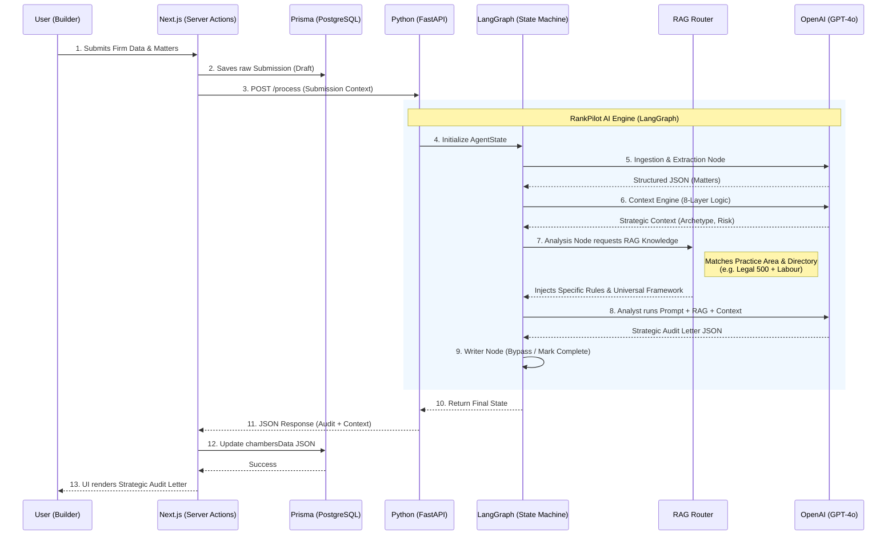
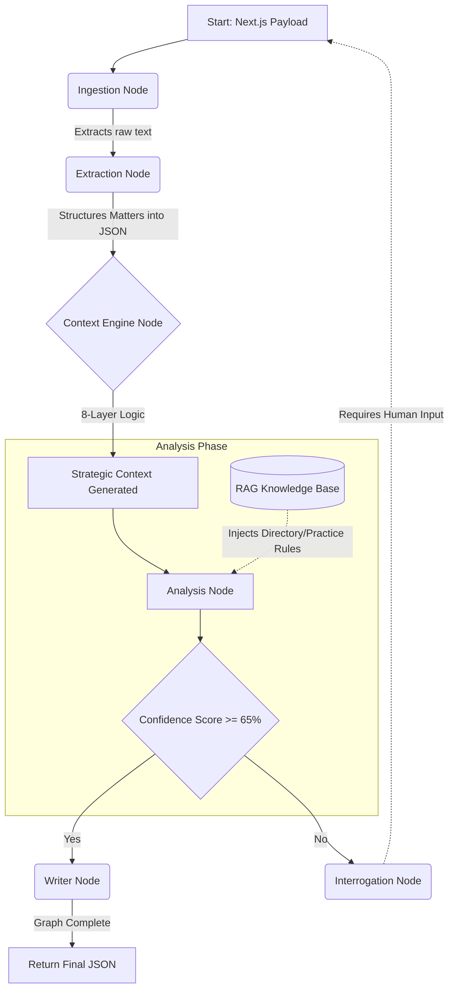

# RankPilot AI Engine Architecture (v2)

This document illustrates the complete end-to-end flow of the RankPilot AI Engine, incorporating the Next.js Frontend, the FastAPI Backend, the LangGraph State Machine, and the new RAG (Retrieval-Augmented Generation) system.

## High-Level Architecture Diagram

## Internal LangGraph Flow

This represents the internal state machine flow (`ai-engine/core/graph.py`).

## Data Persistence Strategy

The Python backend is completely stateless. It acts purely as a processing engine. All data is managed by **Next.js** and stored in **Prisma (PostgreSQL)**.

- **`TargetDirectory`, `PracticeArea`, `Region`**: Stored as native Prisma columns on the `Submission` model.
- **Matters**: Stored as related records in the `Matter` model.
- **AI Analytics (`StrategicContext`, `AuditLetter`, `Score`)**: Stored entirely within the `chambersData` JSON column in the `Submission` model, allowing maximum flexibility for future AI additions without needing constant database migrations.
