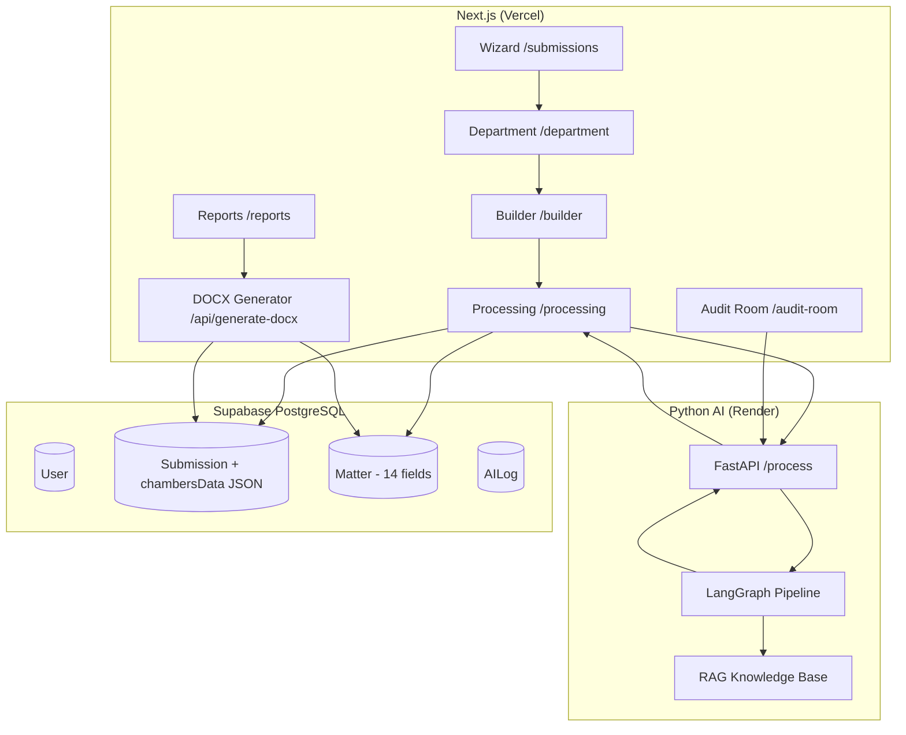

# RankPilot — Documentación Técnica v3.0

Este documento describe la arquitectura completa, flujo de datos y componentes de **RankPilot**, la plataforma B2B SaaS para automatizar _Submissions_ de directorios legales (Chambers & Partners, Legal 500) mediante IA.

---

## 1. Arquitectura del Sistema

### 1.1 Tech Stack

| Capa | Tecnología |
|------|-----------|
| Frontend & Orquestador | Next.js 16 (App Router) + React + Turbopack |
| Estilos | Vanilla CSS (Glassmorphism, Premium UI) + Lucide Icons |
| Base de Datos | PostgreSQL (Supabase) via **Prisma ORM v7** |
| Autenticación | Supabase Auth |
| Backend de IA | Python FastAPI + LangChain + **LangGraph** (OpenAI GPT-4o) |
| Generación DOCX | npm `docx` — template Chambers pixel-perfect |
| Despliegue Web | Vercel (auto-deploy desde `dev` y `main`) |
| Despliegue IA | Render (Python API) |

### 1.2 Diagrama de Arquitectura



---

## 2. Esquema de Base de Datos (Prisma v7)

### 2.1 Modelo `User`
```
id, email, role (USER/ADMIN/SUPERADMIN), stripeCustomerId, subscriptionId, status
```

### 2.2 Modelo `Submission`
```
id, userId, targetDirectory, guideRegion, practiceArea, currentBand
status (Draft/In_Review/Submitted/Accepted/Rejected)
completenessScore, documentUrl, deadline
chambersData (JSON) ← Contiene TODA la data de departamento, lawyers, contacts, análisis AI
submittedAt, acceptedAt, rejectedAt, createdAt, updatedAt
```

### 2.3 Modelo `Matter` (14 campos activos)
```
id, submissionId, name, client, value, leadPartner
rawNotes (Text), optimizedText (Text)
status, threadId
── Campos Chambers (agregados v3) ──
isConfidential (Boolean)  → Determina Section D vs E
crossBorder (String?)     → Jurisdicciones involucradas
teamMembers (String?)     → Otros miembros del equipo
otherFirms (String?)      → Otros bufetes asesores
completionDate (String?)  → Fecha de completación
otherInfo (String?)       → Links de prensa, etc.
isNewClient (Boolean)     → Cliente nuevo en últimos 12 meses
createdAt, updatedAt
```

### 2.4 Modelo `AILog`
```
id, userId, matterId, prompt (Text), response (Text), durationMs, createdAt
```

### 2.5 Estructura de `chambersData` (JSON)

```json
{
  "contacts": [{"name": "", "email": "", "phone": ""}],
  "departmentName": "Banking & Finance",
  "numPartners": 5,
  "numLawyers": 12,
  "departmentHeads": [{"name": "", "email": "", "phone": ""}],
  "hires": [{"name": "", "status": "Joined", "firm": ""}],
  "lawyers": [{
    "name": "", "url": "", "currentRank": "Band 3",
    "suggestedRank": "Band 2", "focus": "", "bio": "",
    "standoutWork": "", "isPartner": true, "isRanked": true
  }],
  "departmentDesc": "B7 — What the department is best known for...",
  "feedback": "C2 — Feedback on Chambers coverage...",
  "metadata": {"firm_name": "", "practice_area": "", "location": ""},
  "analysis": {"confidence_score": 85, "recommendations": []},
  "strategicContext": {"starting_position": "", "archetype": ""}
}
```

---

## 3. Flujo de Trabajo del Usuario (6 pasos)

### 3.1 Setup Wizard (`/submissions`)
- Selección de: Directorio destino, Guía/Región, Área de Práctica, Current Band, Deadline
- **3 métodos de entrada:**
  - Upload .docx → AI extrae todo automáticamente
  - Paste Raw Text → AI extrae todo automáticamente
  - Start from Scratch → Paso manual de departamento

### 3.2 Department & Lawyers (`/submissions/department`) — NUEVO v3
- **Sección A4:** Contactos para entrevistas (array dinámico)
- **Sección B1-B3:** Nombre departamento, # socios, # abogados
- **Sección B4:** Department Heads / Key Partners
- **Sección B5:** Hires / Departures (últimos 12 meses)
- **Sección B6:** Perfiles de abogados (name, URL, current rank, suggested rank, focus, bio, standout work, isPartner, isRanked)
- **Sección B7:** Descripción del departamento (500 palabras max)
- **Sección C2:** Feedback sobre la cobertura de Chambers
- Todos los datos se guardan en `chambersData` JSON via `updateSubmissionDepartment()`

### 3.3 Matter Builder (`/submissions/builder`) — EXTENDIDO v3
- Cards interactivas con **14 campos** por matter:
  - Core: name, client, value, leadPartner, rawNotes
  - Chambers: isConfidential (toggle), crossBorder, teamMembers, otherFirms, completionDate, otherInfo, isNewClient
- Server Action `createMatter()` persiste todos los campos

### 3.4 AI Processing (`/submissions/processing`)
- Envía datos al backend Python via `POST /process`
- AI extrae, analiza y optimiza automáticamente
- Resultados se persisten en `Matter` rows + `chambersData` JSON

### 3.5 Audit Room (`/submissions/audit-room`)
- Chat con Co-piloto IA (Interrogator Node)
- Barra de progreso de completitud
- Umbral: ≥65% confidence → puede compilar reporte

### 3.6 Reports (`/reports`)
- Vista de todos los proyectos con su estado
- Botón de descarga DOCX → `/api/generate-docx`

---

## 4. Motor de IA (Python LangGraph)

### 4.1 Pipeline de 7 Nodos

```
ingestion → extraction → context_engine → analysis → [confidence ≥ 65%?]
                                                        ├── YES → optimization → writing → END
                                                        └── NO  → interrogation → END (pausa)
```

### 4.2 Schemas de Extracción (Pydantic)

| Modelo | Campos |
|--------|--------|
| `SubmissionSchema` | metadata, department, lawyers[], contacts[], matters[] |
| `Matter` | title, client, summary, significance, lead_partner, is_cross_border, cross_border_jurisdictions, team_members, other_firms, matter_value, completion_date, is_confidential, is_new_client |
| `LawyerProfile` | name, url, current_ranking, suggested_ranking, key_focus, bio, standout_work, is_partner, is_ranked |
| `ContactPerson` | name, email, phone |
| `HireDeparture` | name, status (Joined/Departed), firm |
| `DepartmentInfo` | department_name, num_partners, num_lawyers, department_heads[], hires_departures[], department_description |
| `ContextEngineOutput` | practice_type, archetype, complexity_profile, client_type, identity_adn |

### 4.3 Mapeo AI → DB (snake_case → camelCase)

```
AI Output                        → Database/chambersData
─────────────────────────────────────────────────────────
department.department_name       → chambersData.departmentName
department.num_partners          → chambersData.numPartners
department.department_heads[]    → chambersData.departmentHeads[]
lawyers[].current_ranking        → chambersData.lawyers[].currentRank
lawyers[].standout_work          → chambersData.lawyers[].standoutWork
matter.is_confidential           → Matter.isConfidential
matter.cross_border_jurisdictions → Matter.crossBorder
matter.team_members              → Matter.teamMembers
matter.completion_date           → Matter.completionDate
matter.is_new_client             → Matter.isNewClient
```

---

## 5. Generador DOCX (submission-builder.ts)

### 5.1 Estructura del Template Chambers

| Sección | Contenido | Fuente de Datos |
|---------|-----------|----------------|
| Title Page | Branding Chambers + instrucciones | Estático |
| A1-A3 | Firm name, Practice Area, Location | `submission.*` |
| A4 | Contacts for interviews | `chambersData.contacts[]` |
| B1-B3 | Department name, # Partners, # Lawyers | `chambersData.*` |
| B4 | Department Heads | `chambersData.departmentHeads[]` |
| B5 | Hires / Departures | `chambersData.hires[]` |
| B6 | Lawyer profiles (5-col table) | `chambersData.lawyers[]` |
| B7 | Department description | `chambersData.departmentDesc` |
| C1 | Barristers (optional, UK/AU) | Vacío (template) |
| C2 | Feedback on coverage | `chambersData.feedback` |
| D0 | Publishable clients list | Auto-generated from matters |
| D1-D9 | Publishable matters (per matter) | `Matter` where `isConfidential=false` |
| E0 | Confidential clients list | Auto-generated from matters |
| E1-E9 | Confidential matters (per matter) | `Matter` where `isConfidential=true` |

### 5.2 Especificaciones Visuales
- **Font:** Times New Roman (todo el documento)
- **Celdas de datos:** Fondo amarillo `#FFFFCC`
- **Bordes:** `BorderStyle.SINGLE`, 1pt, negro
- **Header:** "Ref: PAB006" (derecha)
- **Footer:** URL de Chambers + link de onboarding
- **Márgenes:** 1 pulgada (1440 DXA) en todos lados

---

## 6. RBAC (Control de Acceso por Roles)

| Rol | Permisos |
|-----|----------|
| **SUPERADMIN** | Control total, crear admins, configuración SMTP |
| **ADMIN** | Gestionar usuarios SaaS, ver métricas |
| **USER** | Builder, Matters, Reports (su propia data) |

---

## 7. Variables de Entorno

| Variable | Descripción |
|----------|-------------|
| `DATABASE_URL` | Supabase pooler (puerto 6543) |
| `DIRECT_URL` | Supabase directo (puerto 5432, migraciones) |
| `NEXT_PUBLIC_SUPABASE_URL` | URL pública de Supabase |
| `NEXT_PUBLIC_SUPABASE_ANON_KEY` | Anon key para cliente |
| `SUPABASE_SERVICE_ROLE_KEY` | Llave maestra (admin ops) |
| `PYTHON_API_URL` | Backend IA en Render |
| `OPENAI_API_KEY` | Acceso a GPT-4o |

---

## 8. Archivos Clave

| Archivo | Descripción |
|---------|-------------|
| `prisma/schema.prisma` | 4 modelos, Matter con 14 campos |
| `ai-engine/core/schema.py` | Pydantic schemas (7 modelos) |
| `ai-engine/core/graph.py` | LangGraph state machine (7 nodos) |
| `ai-engine/agents/nodes.py` | Lógica de cada nodo AI |
| `src/app/api/generate-docx/submission-builder.ts` | Generador DOCX Chambers |
| `src/app/api/generate-docx/route.ts` | API route (delega al builder) |
| `src/app/api/process-document/route.ts` | Bridge Next.js → Python AI |
| `src/app/actions/submissions.ts` | Server actions (create, updateDepartment) |
| `src/app/actions/matters.ts` | Server actions (create 14 fields, optimize) |
| `src/app/submissions/department/page.tsx` | Wizard de departamento/lawyers |
| `src/app/submissions/builder/page.tsx` | Builder de matters (14 campos/card) |

---

*Documento actualizado en la iteración v3.0 — RankPilot 2026. Julio 10, 2026.*
