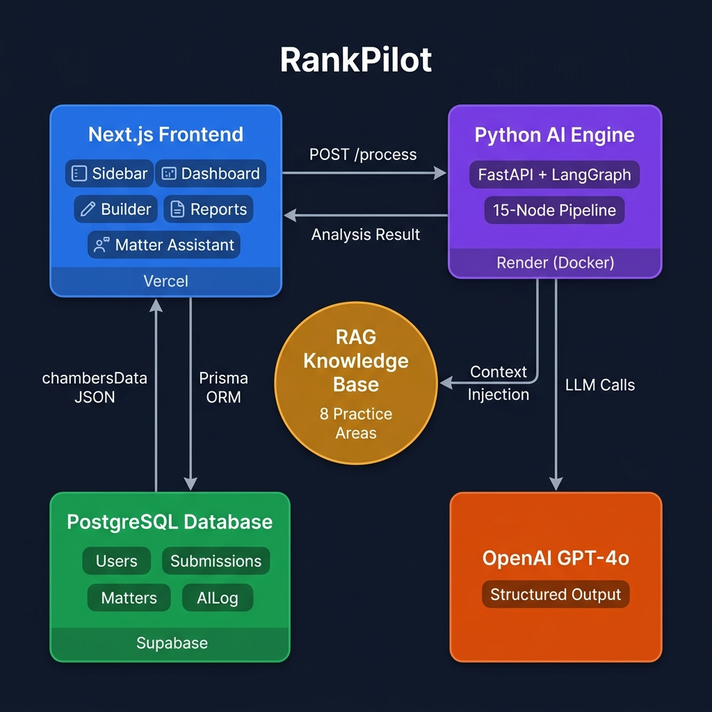
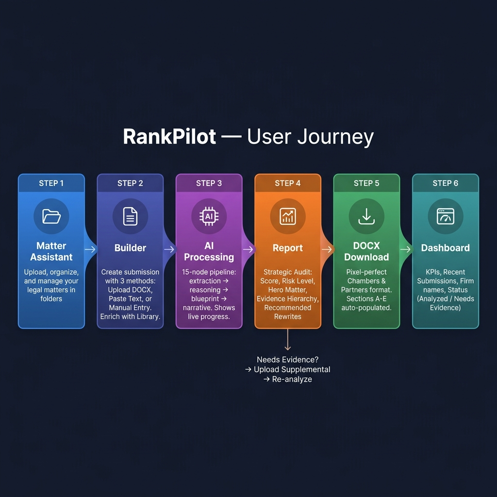
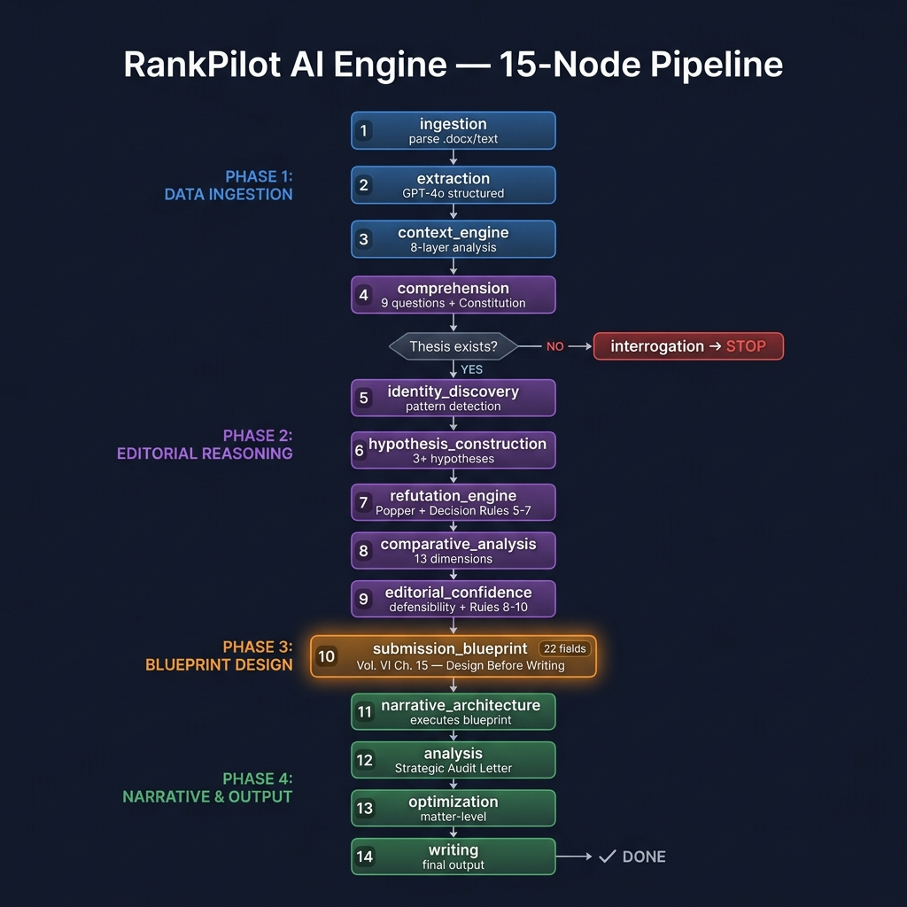
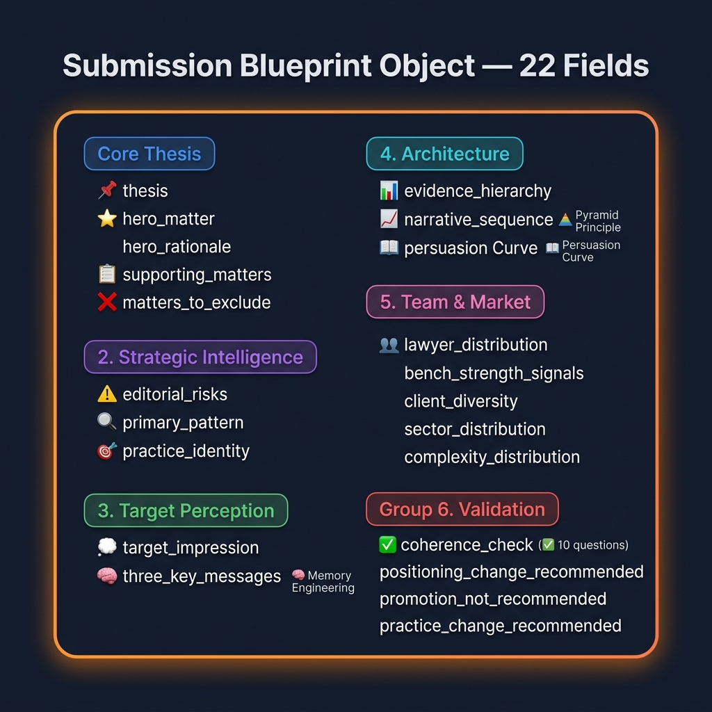
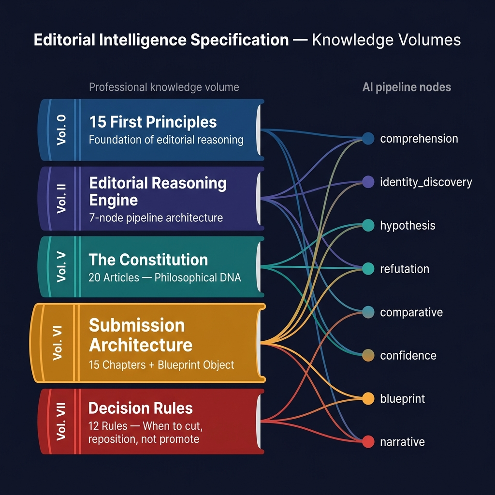
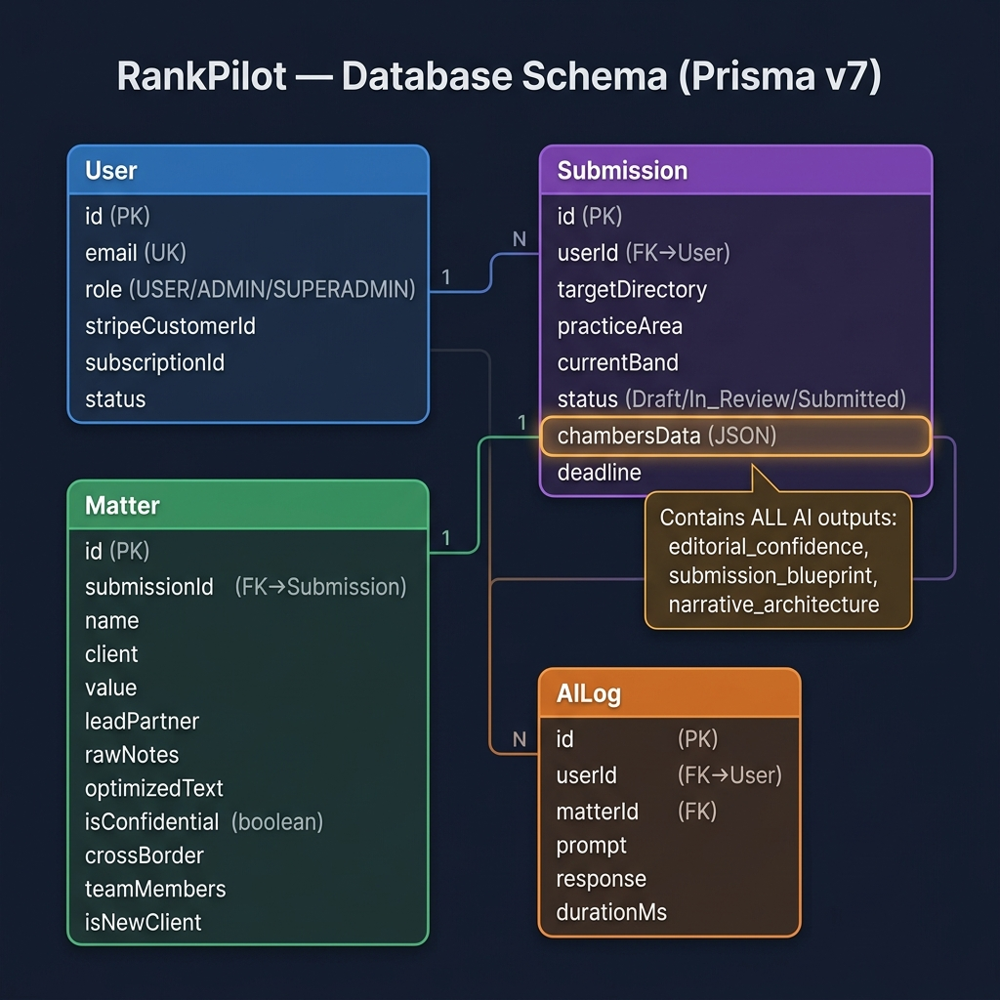

# RankPilot — Documentación Técnica v4.0

> **Última actualización:** Julio 15, 2026
> **Versión:** 4.0 — Integra Editorial Playbook Vol. V-VII

---

## 1. Arquitectura de la Plataforma

### 1.1 Tech Stack

| Capa | Tecnología |
|------|-----------|
| Frontend & Orquestador | Next.js 16 (App Router) + React 19 + Turbopack |
| Estilos | Vanilla CSS (Glassmorphism, Premium UI) + Lucide Icons |
| Base de Datos | PostgreSQL (Supabase) via **Prisma ORM v7** |
| Autenticación | Supabase Auth |
| Backend de IA | Python FastAPI + LangChain + **LangGraph** (OpenAI GPT-4o) |
| Generación DOCX | npm `docx` — template Chambers pixel-perfect |
| Despliegue Web | Vercel (auto-deploy desde `dev` y `main`) |
| Despliegue IA | Render (Docker Python API) |

### 1.2 Diagrama General de Arquitectura



**Conexiones principales:**

| Origen | Destino | Protocolo | Descripción |
|--------|---------|-----------|-------------|
| Next.js → FastAPI | `POST /process` | HTTPS | Envía texto + contexto para análisis AI |
| Next.js → PostgreSQL | Prisma ORM | TCP (6543) | CRUD de Users, Submissions, Matters, AILog |
| FastAPI → GPT-4o | LangChain | HTTPS | 15 llamadas de structured output por submission |
| FastAPI → RAG | File I/O | Local | Lee archivos de conocimiento por área de práctica |
| FastAPI → Next.js | JSON Response | HTTPS | Retorna análisis completo (chambersData) |

---

## 2. Flujo del Usuario (6 Pasos)



| Paso | Módulo | Ruta | Qué ocurre |
|------|--------|------|------------|
| 1 | **Matter Assistant** | `/matters-assistant` | Subir, organizar, etiquetar matters en carpetas con búsqueda |
| 2 | **Builder** | `/submissions` | Crear submission: Upload DOCX, Paste Text, o Manual + enriquecer desde la biblioteca |
| 3 | **AI Processing** | `/submissions/processing` | Pipeline de 15 nodos ejecuta con indicadores de progreso en vivo |
| 4 | **Report** | `/reports/[id]` | Audit Estratégico: Score, Risk, Hero Matter, Rewrites sugeridos. Upload suplementario si falta evidencia |
| 5 | **DOCX Download** | `/api/generate-docx` | Genera documento formato Chambers (Secciones A-E) pixel-perfect |
| 6 | **Dashboard** | `/dashboard-analytics` | KPIs, submissions recientes, nombre de firma, estatus por confianza editorial |

> **Flujo alterno:** Si el reporte indica "Needs Evidence", el usuario puede subir evidencia suplementaria y re-analizar sin perder el progreso.

---

## 3. Motor de IA — Pipeline de 15 Nodos



### 3.1 Detalle por Fase

**🔵 FASE 1 — Ingestión de Datos (Nodos 1-3)**

| # | Nodo | Función | Output |
|---|------|---------|--------|
| 1 | `ingestion` | Parsea .docx/.pdf/texto crudo | `doc_text` (string limpio) |
| 2 | `extraction` | GPT-4o extracción estructurada | `metadata` + `matters[]` (SubmissionSchema) |
| 3 | `context_engine` | Análisis 8 capas estratégicas | `strategic_context` (archetype, complexity, ADN) |

**🟣 FASE 2 — Razonamiento Editorial (Nodos 4-9)**

| # | Nodo | Gobernado por | Output clave |
|---|------|--------------|-------------|
| 4 | `comprehension` | Constitución Arts VII,VIII,X,XIV | `thesis_exists` + `evidence_sufficient` |
| 5 | `identity_discovery` | Principios 4, 5, 6 | `identity_statement` + `recurring_patterns` |
| 6 | `hypothesis_construction` | Principios 4, 8, 12 | 3+ hipótesis editoriales con scores |
| 7 | `refutation_engine` | Popper + Decision Rules 5,6,7,11 | `surviving_hypotheses` + `destroyed_hypotheses` |
| 8 | `comparative_analysis` | Principios 1, 7, 11 | 13 dimensiones + `band_alignment` |
| 9 | `editorial_confidence` | Rules 8,9,10 + Arts VII,XIV | `overall_confidence` + `recommendation` |

> **⚠️ Decision Gate:** Después del Nodo 4, si NO existe thesis o la evidencia es insuficiente → ruta a **interrogation → STOP** para solicitar más datos.

**🟠 FASE 3 — Diseño del Blueprint (Nodo 10) — NUEVO v4**

| # | Nodo | Input | Output |
|---|------|-------|--------|
| 10 | `submission_blueprint` | Todos los outputs previos + matters | **Objeto de 22 campos** (SubmissionBlueprintOutput) |

> Este es el nodo **más impactante** — introducido por Vol. VI Ch. 15. La IA **DISEÑA** la estructura completa antes de escribir una sola palabra.

**🟢 FASE 4 — Narrativa y Output (Nodos 11-14)**

| # | Nodo | Función | Output |
|---|------|---------|--------|
| 11 | `narrative_architecture` | Ejecuta el Blueprint en plan editorial | thesis, hero_matter, matter_hierarchy, narrative_arc |
| 12 | `analysis` | Genera Carta de Audit Estratégico | risk_level, score, secciones de audit, evaluaciones |
| 13 | `optimization` | Optimización texto por matter | `optimized_text` (100-200 palabras c/u) |
| 14 | `writing` | Output final | Contenido LaTeX/DOCX-ready |

---

## 4. Submission Blueprint Object (22 Campos)



### 4.1 Referencia de Campos

| Grupo | Campos | Propósito |
|-------|--------|-----------|
| **Core Thesis** | `thesis`, `hero_matter`, `hero_rationale`, `supporting_matters`, `matters_to_exclude` | EL argumento único + arquitectura de evidencia |
| **Inteligencia Estratégica** | `editorial_risks`, `primary_pattern`, `secondary_pattern`, `practice_identity` | Qué ES la firma (descubierto, no asumido) |
| **Percepción Objetivo** | `target_impression`, `three_key_messages` | Memory Engineering: qué recuerda el researcher 1 semana después |
| **Arquitectura** | `evidence_hierarchy`, `narrative_sequence` | Principio Piramidal + curva de persuasión |
| **Equipo y Mercado** | `lawyer_distribution`, `bench_strength_signals`, `client_diversity`, `sector_distribution`, `complexity_distribution` | Evidencia de profundidad institucional |
| **Validación** | `coherence_check` (10 booleans), `positioning_change_recommended`, `promotion_not_recommended`, `practice_change_recommended` | Auto-validación antes de proceder |

### 4.2 Sub-Schemas

**MatterDisposition** — Decisión por matter:
```
matter_title → disposition (include_as_hero | include_as_supporting | exclude | reposition)
             → rationale (¿por qué?)
             → proves_what (¿qué prueba único?)
             → redundant_with (si excluido, ¿cuál matter ya lo prueba?)
```

**EditorialCoherenceCheck** — 10 preguntas de auto-validación:
```
✓ thesis_identifiable        ✓ all_matters_contribute      ✓ hero_demonstrates_thesis
✓ supporting_confirm_pattern  ✓ narrative_thread_continuous
✓ evidence_distribution_balanced  ✓ narrative_matches_positioning
✓ cognitive_load_minimized    ✓ conclusions_supported        ✓ impression_memorable
→ passes_coherence (8+ = true) + redesign_notes
```

---

## 5. Volúmenes de Inteligencia Editorial



### 5.1 Volumen → Nodo Mapping

| Volumen | Contenido | Nodos que alimenta |
|---------|-----------|-------------------|
| **Vol. 0** | 15 Primeros Principios (P1-P15) | TODOS los nodos editoriales |
| **Vol. II** | Editorial Reasoning Engine (9 capítulos) | Arquitectura del pipeline |
| **Vol. V** | La Constitución (20 Artículos) | comprehension (6 arts), confidence (4 arts), blueprint (los 20) |
| **Vol. VI** | Submission Architecture (15 capítulos) | **blueprint** (los 15 capítulos), **narrative** (ejecuta blueprint) |
| **Vol. VII** | Decision Rules (12 reglas) | refutation (Rules 5-7,11), confidence (Rules 8-10), **blueprint** (las 12) |

### 5.2 Artículos Constitucionales Clave

| Artículo | Principio | Dónde se aplica |
|----------|-----------|-----------------|
| Art. VII | Credibilidad > Persuasión | comprehension, confidence, blueprint |
| Art. VIII | El researcher es el usuario final invisible | comprehension, blueprint |
| Art. X | Submission = Demostración, nunca compilación | comprehension, blueprint |
| Art. XII | Excelencia es SELECCIONAR, no acumular | refutation, blueprint |
| Art. XIV | La incertidumbre debe ser explícita | comprehension, confidence |
| Art. XIX | Conocimiento (RAG) separado de Razonamiento | comprehension, blueprint |

### 5.3 Decision Rules Clave

| Rule | Decisión | Dónde se aplica |
|------|----------|-----------------|
| Rule 5 | Cuándo un matter debe DESAPARECER | refutation, blueprint |
| Rule 6 | Cuándo un matter pequeño > matter grande | refutation, blueprint |
| Rule 7 | Cuándo CAMBIAR el posicionamiento | refutation, blueprint |
| Rule 8 | Cuándo NO recomendar promoción | confidence, blueprint |
| Rule 9 | Cuándo esperar UN AÑO MÁS | confidence, blueprint |
| Rule 10 | Cuándo cambiar de área de práctica | confidence, blueprint |

---

## 6. Base de Datos (Prisma v7)



### 6.1 Estructura de `chambersData` (JSON)

```json
{
  "contacts": [{"name": "", "email": "", "phone": ""}],
  "departmentName": "Banking & Finance",
  "numPartners": 5,
  "numLawyers": 12,
  "departmentHeads": [{"name": "", "email": "", "phone": ""}],
  "hires": [{"name": "", "status": "Joined", "firm": ""}],
  "lawyers": [{
    "name": "", "url": "", "currentRank": "Band 3",
    "suggestedRank": "Band 2", "focus": "", "bio": "",
    "standoutWork": "", "isPartner": true, "isRanked": true
  }],
  "departmentDesc": "B7 text...",
  "feedback": "C2 text...",
  "metadata": {"firm_name": "", "practice_area": "", "location": ""},
  "analysis": {"confidence_score": 85, "recommendations": []},
  "strategicContext": {"starting_position": "", "archetype": ""},
  "editorial_confidence": {"overall_confidence": "high"},
  "submission_blueprint": {"thesis": "", "hero_matter": "", "...": "22 campos"},
  "narrative_architecture": {"thesis_statement": "", "hero_matter": ""}
}
```

---

## 7. Generador DOCX (submission-builder.ts)

| Sección | Contenido | Fuente de Datos |
|---------|-----------|----------------|
| Title | Branding Chambers + instrucciones | Estático |
| A4 | Contacts for interviews | `chambersData.contacts[]` |
| B1-B3 | Department name, # Partners, # Lawyers | `chambersData.*` |
| B4 | Department Heads | `chambersData.departmentHeads[]` |
| B5 | Hires / Departures | `chambersData.hires[]` |
| B6 | Lawyer profiles (tabla 5 columnas) | `chambersData.lawyers[]` |
| B7 | Department description | `chambersData.departmentDesc` |
| C2 | Feedback on coverage | `chambersData.feedback` |
| D0-D9 | Matters publicables | `Matter` donde `isConfidential=false` |
| E0-E9 | Matters confidenciales | `Matter` donde `isConfidential=true` |

**Formato:** Times New Roman, celdas amarillas `#FFFFCC`, bordes 1pt, header "Ref: PAB006".

---

## 8. API Endpoints

| Capa | Ruta | Método | Propósito |
|------|------|--------|-----------|
| Next.js | `/api/process-document` | POST | Bridge → Python AI engine |
| Next.js | `/api/generate-docx` | POST | Generar DOCX formato Chambers |
| Next.js | `/api/recent-submissions` | GET | Datos dinámicos para sidebar |
| Python | `/health` | GET | Health check |
| Python | `/process` | POST | Pipeline completo de 15 nodos |
| Python | `/optimize-matter` | POST | Optimización de un solo matter |

---

## 9. Server Actions (8 archivos)

| Action | Archivo | Funciones clave |
|--------|---------|----------------|
| Submissions | `submissions.ts` | `createSubmission`, `updateSubmissionDepartment` |
| Matters | `matters.ts` | `createMatter` (14 campos), `optimizeMatterWithAI` |
| Library | `library.ts` | `getLibraryMatters`, `createLibraryMatter`, folder CRUD |
| Reports | `reports.ts` | `getReports`, `getReportById` |
| Dashboard | `dashboard.ts` | `getDashboardStats` (KPIs + recientes con chambersData) |
| Admin | `admin.ts` | User CRUD (RBAC-protected) |

---

## 10. RBAC y Variables de Entorno

| Rol | Permisos |
|-----|----------|
| **SUPERADMIN** | Control total, crear admins, configuración |
| **ADMIN** | Gestionar usuarios SaaS, ver métricas |
| **USER** | Matter Assistant, Builder, Reports, Dashboard |

| Variable | Descripción |
|----------|-------------|
| `DATABASE_URL` | Supabase pooler (puerto 6543) |
| `DIRECT_URL` | Supabase directo (5432, migraciones) |
| `NEXT_PUBLIC_SUPABASE_URL` | URL pública de Supabase |
| `NEXT_PUBLIC_SUPABASE_ANON_KEY` | Anon key |
| `SUPABASE_SERVICE_ROLE_KEY` | Llave maestra (admin) |
| `PYTHON_API_URL` | Backend IA en Render |
| `OPENAI_API_KEY` | Acceso a GPT-4o |

---

## 11. Estructura del Workspace

```
rankpilot-new-repo/
├── ai-engine/                        # Python AI Backend (Render)
│   ├── main.py                       # FastAPI: /process, /health, /optimize-matter
│   ├── agents/
│   │   ├── nodes.py                  # 7 nodos originales
│   │   ├── editorial_nodes.py        # 8 nodos de razonamiento editorial
│   │   └── prompts.py               # Todos los prompts (Vol. 0-VII)
│   ├── core/
│   │   ├── graph.py                  # LangGraph 15 nodos
│   │   ├── schema.py                # 25+ Pydantic schemas
│   │   └── state.py                 # AgentState (20+ campos)
│   ├── utils/rag_router.py          # RAG routing (8 áreas de práctica)
│   └── rag_knowledge/               # Archivos de conocimiento RAG
├── docs/diagrams/                   # Diagramas visuales de arquitectura
├── prisma/schema.prisma             # 4 modelos
├── src/app/                         # Páginas Next.js
│   ├── matters-assistant/           # Biblioteca CRUD + carpetas + búsqueda
│   ├── submissions/                 # Builder + Department + Processing
│   ├── reports/                     # Tabla + Detalle + Upload Suplementario
│   ├── dashboard-analytics/         # KPIs + Recientes
│   ├── api/                         # 5 API routes
│   └── actions/                     # 8 archivos de Server Actions
└── src/components/                  # Sidebar, Topbar (⌘K+🔔), Wizard
```

---

*Documento actualizado v4.0 — RankPilot 2026. Julio 15, 2026.*
*Integra Vol. V-VII: Constitución (20 Artículos), Submission Architecture (15 Capítulos), Decision Rules (12 Reglas).*
