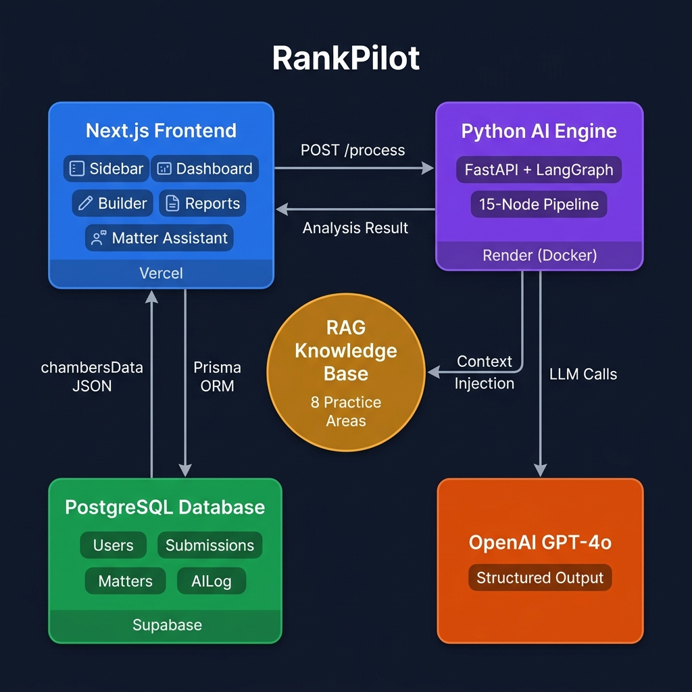
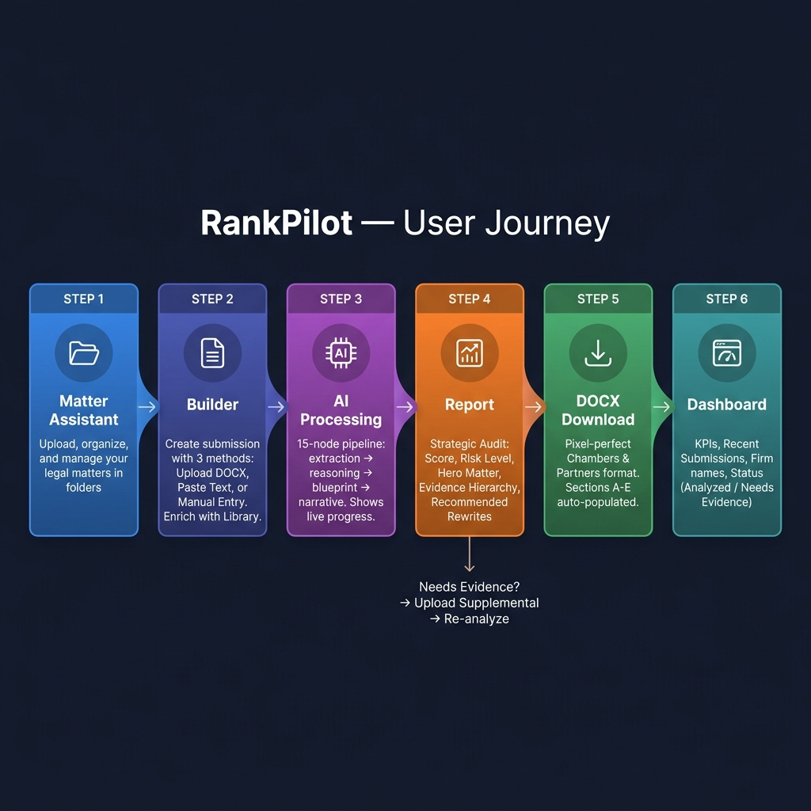
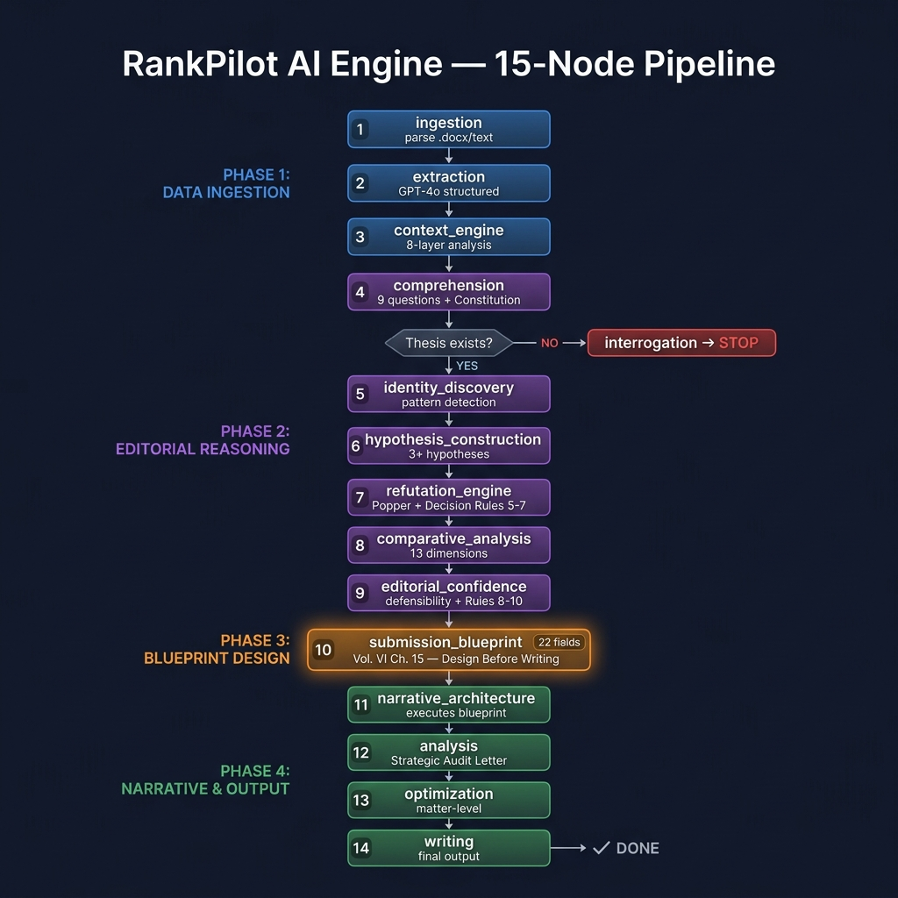
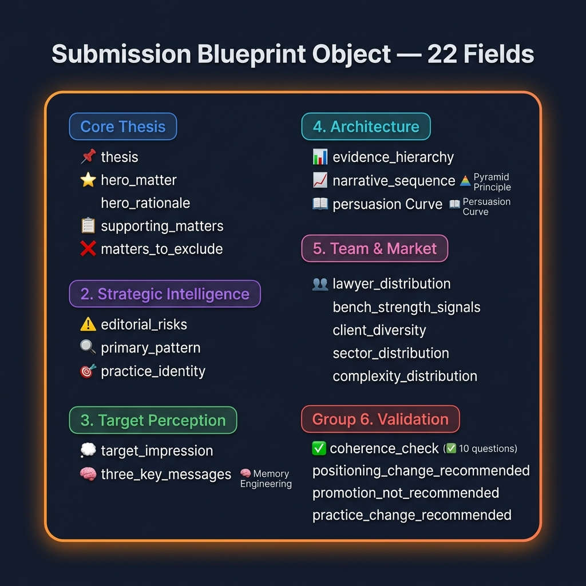
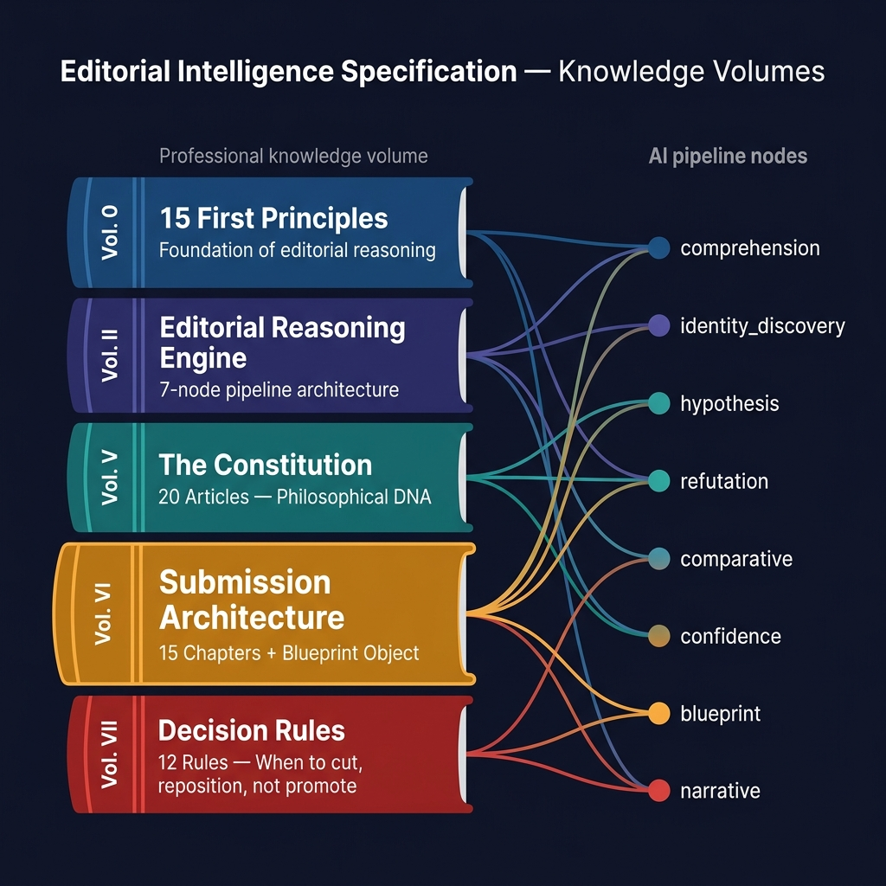

# RankPilot — Documentación Técnica v6.0

> **Última actualización:** Julio 27, 2026
> **Versión:** 6.0 — RAG v1 Full Integration, Archetype Rubric, Confidentiality Calibration, Markdown Strip
> **Versiones cubiertas:** v10.0 → v10.2 → v11.0

---

## 1. Arquitectura de la Plataforma

### 1.1 Tech Stack

| Capa | Tecnología |
|------|-----------|
| Frontend & Orquestador | Next.js 16 (App Router) + React 19 + Turbopack |
| Estilos | Vanilla CSS (Glassmorphism, Premium UI) + Lucide Icons |
| Base de Datos | PostgreSQL (Supabase) via **Prisma ORM v7** |
| Autenticación | Supabase Auth |
| Backend de IA | Python FastAPI + LangChain + **LangGraph** (OpenAI GPT-4o) |
| Generación DOCX | npm `docx` (submission-builder.ts) + python-docx (docx_generator.py) |
| RAG Knowledge | **44 archivos** (.txt) — 4 directorios, 8+ áreas de práctica |
| SaaS Payments | **Stripe Checkout** + Webhooks |
| Email Transaccional | **Resend** (plantillas dinámicas) |
| Despliegue Web | Vercel (auto-deploy desde `dev` y `main`) |
| Despliegue IA | Render (Docker Python API) |

### 1.2 Diagrama General de Arquitectura



**Conexiones principales:**

| Origen | Destino | Protocolo | Descripción |
|--------|---------|-----------|-------------|
| Next.js → FastAPI | `POST /process` | HTTPS | Envía texto + contexto para análisis AI |
| Next.js → PostgreSQL | Prisma ORM | TCP (6543) | CRUD de Users, Submissions, Matters, AILog |
| FastAPI → GPT-4o | LangChain | HTTPS | 15 llamadas de structured output por submission |
| FastAPI → RAG | `rag_router.py` | Local | Lee hasta 7 archivos + 5 globals por área de práctica |
| FastAPI → Next.js | JSON Response | HTTPS | Retorna análisis completo (chambersData) |

---

## 2. Flujo del Usuario (6 Pasos)



| Paso | Módulo | Ruta | Qué ocurre |
|------|--------|------|------------|
| 1 | **Matter Assistant** | `/matters-assistant` | Subir, organizar, etiquetar matters en carpetas con búsqueda |
| 2 | **Builder** | `/submissions` | Crear submission: Upload DOCX, Paste Text, o Manual + Setup Wizard (5 filtros) |
| 3 | **AI Processing** | `/submissions/processing` | Pipeline de 15 nodos ejecuta con indicadores de progreso en vivo |
| 4 | **Report** | `/reports/[id]` | Audit Estratégico: Score, Risk, Hero Matter, Rewrites sugeridos. Upload suplementario si falta evidencia |
| 5 | **DOCX Download** | `/api/generate-docx` | Genera documento formato Chambers (Secciones A-E) pixel-perfect |
| 6 | **Dashboard** | `/dashboard-analytics` | KPIs, submissions recientes, nombre de firma, estatus por confianza editorial |

> **Setup Wizard (v10.0):** 5 filtros contextuales obligatorios antes de procesar — practice_area, directory, jurisdiction, current_band, target_band. Estos datos se inyectan en el pipeline como `MANDATORY_UNIVERSE_FACTS`.

---

## 3. Motor de IA — Pipeline de 15 Nodos



### 3.1 Detalle por Fase

**🔵 FASE 1 — Ingestión de Datos (Nodos 1-3)**

| # | Nodo | Función | Output |
|---|------|---------|--------|
| 1 | `ingestion` | Parsea .docx/.pdf/texto crudo | `doc_text` (string limpio) |
| 2 | `extraction` | GPT-4o extracción estructurada | `metadata` + `matters[]` (SubmissionSchema) |
| 3 | `context_engine` | Análisis 8 capas estratégicas + **Archetype Rubric (v11.0)** | `strategic_context` (archetype, complexity, ADN) |

**🟣 FASE 2 — Razonamiento Editorial (Nodos 4-9)**

| # | Nodo | Gobernado por | Output clave |
|---|------|--------------|-------------|
| 4 | `comprehension` | Constitución Arts VII,VIII,X,XIV | `thesis_exists` + `evidence_sufficient` |
| 5 | `identity_discovery` | Principios 4, 5, 6 | `identity_statement` + `recurring_patterns` |
| 6 | `hypothesis_construction` | Principios 4, 8, 12 | 3+ hipótesis editoriales con scores |
| 7 | `refutation_engine` | Popper + Decision Rules 5,6,7,11 | `surviving_hypotheses` + `destroyed_hypotheses` |
| 8 | `comparative_analysis` | Principios 1, 7, 11 | 13 dimensiones + `band_alignment` |
| 9 | `editorial_confidence` | Rules 8,9,10 + Arts VII,XIV | `overall_confidence` + `recommendation` |

> **⚠️ Decision Gate:** Después del Nodo 4, si NO existe thesis o la evidencia es insuficiente → ruta a **interrogation → STOP** para solicitar más datos.

**🟠 FASE 3 — Diseño del Blueprint (Nodo 10)**

| # | Nodo | Input | Output |
|---|------|-------|--------|
| 10 | `submission_blueprint` | Todos los outputs previos + matters | **Objeto de 22 campos** (SubmissionBlueprintOutput) |

> Este es el nodo **más impactante** — introducido por Vol. VI Ch. 15. La IA **DISEÑA** la estructura completa antes de escribir una sola palabra.

**🟢 FASE 4 — Narrativa y Output (Nodos 11-14)**

| # | Nodo | Función | Output |
|---|------|---------|--------|
| 11 | `narrative_architecture` | Ejecuta el Blueprint en plan editorial | thesis, hero_matter, matter_hierarchy, narrative_arc |
| 12 | `analysis` | Genera Carta de Audit Estratégico + **Validation Gate (v10.2)** | risk_level, score, secciones de audit, evaluaciones |
| 13 | `optimization` | Optimización texto por matter + **strip_markdown (v11.0)** + Probative Validator | `optimized_text` (plain text, sin markdown) |
| 14 | `writing` | Output final | Contenido LaTeX/DOCX-ready |

### 3.2 Validation Gate (v10.2 — NUEVO)

Después del Nodo 12 (`analysis`), un gate programático valida 7 checks automáticos:

| Check | Validación | Si falla |
|-------|-----------|----------|
| 1 | All matters evaluated | Auto-retry (max 2) |
| 2 | No self-referential language | Auto-retry |
| 3 | Score consistency with risk_level | Auto-retry |
| 4 | Benchmark anchors present | Auto-retry |
| 5 | Deadlines are FUTURE dates | Auto-retry |
| 6 | No "unranked" bias in scoring | Auto-retry |
| 7 | Scoring floor calibration | Auto-retry |

---

## 4. RAG Knowledge System (v11.0 — NUEVO)

### 4.1 Arquitectura del RAG Router

```
rag_knowledge/
├── [44 archivos .txt]              # Base de conocimiento editorial
│
rag_router.py (v11.0)
├── Indexa TODOS los .txt y .md     # Glob pattern: *.txt + *.md
├── Scoring por tiers:
│   ├── Methodology match: +15 pts
│   ├── Scoring/Rubric match: +14 pts
│   ├── Multi-ranking context: +13 pts
│   └── Examples/Rewrites: +12 pts
├── Practice Area keywords: 10 categorías
├── Directory keywords: Chambers, Legal 500, IFLR1000, Leaders League
├── Selecciona TOP 7 archivos específicos
└── Siempre incluye 5 archivos GLOBALES
```

### 4.2 Archivos RAG por Categoría

| Categoría | Archivos | Contenido |
|-----------|----------|-----------|
| **Corporate/M&A** | 8 archivos | Methodology, Taxonomy, Scoring (100pts/8 dimensiones), Directory Overlays, Strong/Weak Matters, Rewrite Examples, RAG Matrix v0 |
| **Banking & Finance** | 12 archivos | Chambers (6: methodology, taxonomy, scoring, strong/weak, rewrites) + Legal 500 (2) + IFLR1000 (2) + Leaders League (2) |
| **Disputes/Litigation** | 2 archivos | RAG Matrix, Chambers Logic |
| **Labour & Employment** | 3 archivos | Chambers Logic, Legal 500 Layer, IFLR/LL Layer |
| **IP/TMT** | 2 archivos | RAG Matrix, IP Taxonomy |
| **Tax** | 4 archivos | Chambers Context Mapping, Legal 500 Logic, Leaders League Layer, IFLR Layer |
| **Competition** | 1 archivo | RAG Matrix |
| **Regulatory** | 2 archivos | RAG Matrix, Legal 500/LL/IFLR Layer |
| **🌍 Globales** | 5 archivos | Editorial Constitution, First Principles (Vol. 0), Vol. II Reasoning Engine, Lawyer Framework, ¿Cómo rankeamos? |
| **Otros** | 5 archivos | Market Intelligence Editorial, Playbook Definitivo, Energy Intelligence, Real Estate |

**Total: 44 archivos de conocimiento** (antes v10: 25 archivos, ~30% cobertura → ahora 100%)

### 4.3 Archetype Rubric (v11.0 — NUEVO)

El `context_engine_node` ahora inyecta un rubric de archetypes por práctica:

| Práctica | Archetypes |
|----------|-----------|
| **Corporate/M&A** | High-End Corporate/M&A · Strong Mid-Market · Emerging Boutique · Corporate Generalist |
| **Banking** | Lender-Driven Finance · Borrower-Side Finance · Full-Spectrum Finance |
| **Disputes** | Elite Arbitration Boutique · Full-Service Litigation · Specialist Disputes |
| **Labour** | Employer-Side · Union/Employee-Side · Strategic Employment Advisory |

> **Fix v11.0:** Antes defaulteaba a "General Practice" por falta de rubric en el prompt. Ahora la AI selecciona el archetype más específico basado en evidencia.

---

## 5. Submission Blueprint Object (22 Campos)



### 5.1 Referencia de Campos

| Grupo | Campos | Propósito |
|-------|--------|-----------|
| **Core Thesis** | `thesis`, `hero_matter`, `hero_rationale`, `supporting_matters`, `matters_to_exclude` | EL argumento único + arquitectura de evidencia |
| **Inteligencia Estratégica** | `editorial_risks`, `primary_pattern`, `secondary_pattern`, `practice_identity` | Qué ES la firma (descubierto, no asumido) |
| **Percepción Objetivo** | `target_impression`, `three_key_messages` | Memory Engineering: qué recuerda el researcher 1 semana después |
| **Arquitectura** | `evidence_hierarchy`, `narrative_sequence` | Principio Piramidal + curva de persuasión |
| **Equipo y Mercado** | `lawyer_distribution`, `bench_strength_signals`, `client_diversity`, `sector_distribution`, `complexity_distribution` | Evidencia de profundidad institucional |
| **Validación** | `coherence_check` (10 booleans), `positioning_change_recommended`, `promotion_not_recommended`, `practice_change_recommended` | Auto-validación antes de proceder |

### 5.2 Sub-Schemas

**MatterDisposition** — Decisión por matter:
```
matter_title → disposition (include_as_hero | include_as_supporting | de_emphasize | reposition)
             → rationale (¿por qué?)
             → proves_what (¿qué prueba único?)
             → redundant_with (si de_emphasize, ¿cuál matter ya lo prueba?)
```

> **v10.2:** `exclude` renombrado a `de_emphasize` — nunca eliminar evidencia, solo bajar prioridad.

**EditorialCoherenceCheck** — 10 preguntas de auto-validación:
```
✓ thesis_identifiable        ✓ all_matters_contribute      ✓ hero_demonstrates_thesis
✓ supporting_confirm_pattern  ✓ narrative_thread_continuous
✓ evidence_distribution_balanced  ✓ narrative_matches_positioning
✓ cognitive_load_minimized    ✓ conclusions_supported        ✓ impression_memorable
→ passes_coherence (8+ = true) + redesign_notes
```

---

## 6. Volúmenes de Inteligencia Editorial



### 6.1 Volumen → Nodo Mapping

| Volumen | Contenido | Nodos que alimenta |
|---------|-----------|-------------------|
| **Vol. 0** | 15 Primeros Principios (P1-P15) | TODOS los nodos editoriales |
| **Vol. II** | Editorial Reasoning Engine (9 capítulos) | Arquitectura del pipeline |
| **Vol. V** | La Constitución (20 Artículos) | comprehension (6 arts), confidence (4 arts), blueprint (los 20) |
| **Vol. VI** | Submission Architecture (15 capítulos) | **blueprint** (los 15 capítulos), **narrative** (ejecuta blueprint) |
| **Vol. VII** | Decision Rules (12 reglas) | refutation (Rules 5-7,11), confidence (Rules 8-10), **blueprint** (las 12) |

### 6.2 Artículos Constitucionales Clave

| Artículo | Principio | Dónde se aplica |
|----------|-----------|-----------------|
| Art. VII | Credibilidad > Persuasión | comprehension, confidence, blueprint |
| Art. VIII | El researcher es el usuario final invisible | comprehension, blueprint |
| Art. X | Submission = Demostración, nunca compilación | comprehension, blueprint |
| Art. XII | Excelencia es SELECCIONAR, no acumular | refutation, blueprint |
| Art. XIV | La incertidumbre debe ser explícita | comprehension, confidence |
| Art. XIX | Conocimiento (RAG) separado de Razonamiento | comprehension, blueprint |

### 6.3 Decision Rules Clave

| Rule | Decisión | Dónde se aplica |
|------|----------|-----------------|
| Rule 5 | Cuándo un matter debe DESAPARECER | refutation, blueprint |
| Rule 6 | Cuándo un matter pequeño > matter grande | refutation, blueprint |
| Rule 7 | Cuándo CAMBIAR el posicionamiento | refutation, blueprint |
| Rule 8 | Cuándo NO recomendar promoción | confidence, blueprint |
| Rule 9 | Cuándo esperar UN AÑO MÁS | confidence, blueprint |
| Rule 10 | Cuándo cambiar de área de práctica | confidence, blueprint |

---

## 7. Confidentiality & Publish Status System (v10.0-v11.0 — NUEVO)

### 7.1 Schema de Clasificación

```python
class Matter(BaseModel):
    is_confidential: bool = Field(default=False)
    publish_status: Literal["publishable", "non_publishable", "confidential"]
```

### 7.2 Pipeline de Confidencialidad (3 capas)

| Capa | Dónde | Lógica |
|------|-------|--------|
| **1. Extraction** | `prompts.py` → `EXTRACTION_SYSTEM_PROMPT` | La AI clasifica basándose en señales explícitas del documento fuente |
| **2. Guardrail** | `nodes.py` → `extraction_node` (líneas 133-160) | Sync programático: `is_confidential` ↔ `publish_status` |
| **3. DOCX Split** | `docx_generator.py` (líneas 104-158) | Matters publishable → Section D, confidential → Section E |

### 7.3 Regla de Default (v11.0 — CAMBIO CRÍTICO)

| Versión | Default "When in Doubt" | Consecuencia |
|---------|------------------------|-------------|
| v10.0 | `non_publishable` | ❌ Section D vacía — todos los matters iban a Section E |
| v11.0 | **`publishable`** | ✅ Solo se clasifican como confidenciales matters con señales EXPLÍCITAS |

**Señales explícitas requeridas para `non_publishable`:**
- Matter bajo header "Non-publishable clients"
- Matter bajo sección "Confidential"
- Matter bajo "Section E" (Chambers) o equivalente
- Tag explícito "non-publishable", "confidential", "not for publication"
- Client en lista "non-publishable clients"

---

## 8. Generador DOCX (submission-builder.ts + docx_generator.py)

### 8.1 Secciones del Documento

| Sección | Contenido | Fuente de Datos |
|---------|-----------|----------------|
| Title | Branding Chambers + instrucciones | Estático |
| A4 | Contacts for interviews | `chambersData.contacts[]` |
| B1-B3 | Department name, # Partners, # Lawyers | `chambersData.*` |
| B4 | Department Heads | `chambersData.departmentHeads[]` |
| B5 | Hires / Departures | `chambersData.hires[]` |
| B6 | Lawyer profiles (tabla 5 columnas) | `chambersData.lawyers[]` |
| B7 | Department description | `chambersData.departmentDesc` |
| C2 | Feedback on coverage | `chambersData.feedback` |
| **D** | **Matters publicables** (v11.0: filtro `publish_status=publishable`) | `Matter` filtrado |
| **E** | **Matters confidenciales** (v11.0: filtro `publish_status≠publishable`) | `Matter` filtrado |

**Formato:** Times New Roman, celdas amarillas `#FFFFCC`, bordes 1pt, header "Ref: PAB006".

### 8.2 Markdown Strip (v11.0 — NUEVO)

Función `strip_markdown()` en `nodes.py` limpia todo output antes del DOCX:

```python
# Remueve: **bold**, *italic*, ## headers, `code`, - bullets, 1. lists
# Se aplica a: optimization_node output, fallback text
```

> **Motivo:** Los LLMs a veces generan markdown formatting aunque el prompt diga plain text. El strip_markdown es una capa defensiva para evitar `**ugly characters**` en el documento final.

---

## 9. Setup Wizard & Directory Router (v10.0 — NUEVO)

### 9.1 Filtros del Setup Wizard

| # | Filtro | Tipo | Ejemplo |
|---|--------|------|---------|
| 1 | Practice Area | Dropdown (8+ opciones) | "Corporate/M&A" |
| 2 | Directory | Dropdown (4 opciones) | "Chambers", "Legal 500", "IFLR1000", "Leaders League" |
| 3 | Jurisdiction | Text input | "Mexico" |
| 4 | Current Band | Dropdown | "Unranked", "Band 1-6" |
| 5 | Target Band | Dropdown | "Band 1-6" |

### 9.2 Inyección de Contexto

Los 5 filtros se inyectan como `MANDATORY_UNIVERSE_FACTS` en el prompt de analysis:

```
MANDATORY_UNIVERSE_FACTS (v10.1):
- FIRM: {firm_name}
- PRACTICE AREA: {practice_area}
- DIRECTORY: {directory}
- JURISDICTION: {jurisdiction}
- CURRENT BAND: {current_band}
- TARGET BAND: {target_band}
- CURRENT DATE: {today}
- NUMBER OF MATTERS: {count}
- PUBLISHABLE: {pub_count} / NON-PUBLISHABLE: {npub_count}
```

---

## 10. API Endpoints

| Capa | Ruta | Método | Propósito |
|------|------|--------|-----------|
| Next.js | `/api/process-document` | POST | Bridge → Python AI engine (incluye Setup Wizard context) |
| Next.js | `/api/generate-docx` | POST | Generar DOCX formato Chambers |
| Next.js | `/api/recent-submissions` | GET | Datos dinámicos para sidebar |
| Next.js | `/api/checkout` | POST | Crear Stripe Checkout Session |
| Next.js | `/api/webhooks/stripe` | POST | Webhook: user creation, dunning, deactivation |
| Next.js | `/api/auth/logout` | POST | Cerrar sesión Supabase Auth |
| Python | `/health` | GET | Health check |
| Python | `/process` | POST | Pipeline completo de 15 nodos |
| Python | `/optimize-matter` | POST | Optimización de un solo matter |

---

## 11. Server Actions (8 archivos)

| Action | Archivo | Funciones clave |
|--------|---------|----------------|
| Submissions | `submissions.ts` | `createSubmission`, `updateSubmissionDepartment` |
| Matters | `matters.ts` | `createMatter` (14 campos), `optimizeMatterWithAI` |
| Library | `library.ts` | `getLibraryMatters`, `createLibraryMatter`, folder CRUD |
| Reports | `reports.ts` | `getReports`, `getReportById` |
| Dashboard | `dashboard.ts` | `getDashboardStats` (KPIs + recientes con chambersData) |
| Admin | `admin.ts` | `createUser`, `toggleUserStatus`, `deleteUser`, `getAdminDashboardMetrics` |
| Settings | `settings.ts` | `getSystemConfig`, `saveSystemConfig`, `saveGTMConfig`, `saveGAConfig` |
| SMTP | `smtp.ts` | `getEmailTemplates`, `saveEmailTemplate`, `testResendConnection`, `saveResendConfig` |

---

## 12. RBAC y Variables de Entorno

| Rol | Permisos |
|-----|----------|
| **SUPERADMIN** | Control total, crear admins, configuración |
| **ADMIN** | Gestionar usuarios SaaS, ver métricas |
| **USER** | Matter Assistant, Builder, Reports, Dashboard |

| Variable | Descripción |
|----------|-------------|
| `DATABASE_URL` | Supabase pooler (puerto 6543) |
| `DIRECT_URL` | Supabase directo (5432, migraciones) |
| `NEXT_PUBLIC_SUPABASE_URL` | URL pública de Supabase |
| `NEXT_PUBLIC_SUPABASE_ANON_KEY` | Anon key |
| `SUPABASE_SERVICE_ROLE_KEY` | Llave maestra (admin) |
| `PYTHON_API_URL` | Backend IA en Render |
| `OPENAI_API_KEY` | Acceso a GPT-4o |
| `STRIPE_SECRET_KEY` | Stripe API (sandbox/prod) |
| `NEXT_PUBLIC_STRIPE_PUBLISHABLE_KEY` | Stripe public key |
| `STRIPE_PRICE_ID` | Product price ID |
| `STRIPE_WEBHOOK_SECRET` | Webhook signing secret |
| `RESEND_API_KEY` | API key para correos transaccionales |

---

## 13. Estructura del Workspace

```
rankpilot-new-repo/
├── ai-engine/                        # Python AI Backend (Render)
│   ├── main.py                       # FastAPI: /process, /health, /optimize-matter
│   ├── agents/
│   │   ├── nodes.py                  # 7 nodos originales + strip_markdown() + Archetype Rubric
│   │   ├── editorial_nodes.py        # 8 nodos de razonamiento editorial
│   │   └── prompts.py               # Todos los prompts (Vol. 0-VII) + Confidentiality v11
│   ├── core/
│   │   ├── graph.py                  # LangGraph 15 nodos
│   │   ├── schema.py                # 25+ Pydantic schemas (publish_status Literal)
│   │   └── state.py                 # AgentState (20+ campos)
│   ├── utils/
│   │   ├── rag_router.py            # v11.0: tiered scoring, top-7, .md support
│   │   ├── docx_generator.py        # v11.0: Section D/E split by publish_status
│   │   ├── directory_config.py      # Chambers vs Legal 500 vs IFLR vs LL config
│   │   └── practice_taxonomy.py     # Practice-specific evaluation criteria
│   └── rag_knowledge/               # 44 archivos de conocimiento RAG
│       ├── Corporate_MA_*_v1.txt    # 7 archivos Corporate/M&A v1
│       ├── Chambers_Banking_*_v1.txt # 6 archivos Banking v1
│       ├── Legal500_Banking_*.txt   # 2 archivos Legal 500
│       ├── IFLR1000_Banking_*.txt   # 2 archivos IFLR1000
│       ├── LeadersLeague_*.txt      # 2 archivos Leaders League
│       ├── EDITORIAL_CONSTITUTION.txt
│       ├── VOLUME_0_FIRST_PRINCIPLES.txt
│       ├── VOLUME_II_EDITORIAL_REASONING_ENGINE.txt
│       └── [25+ archivos adicionales por práctica]
├── docs/diagrams/                   # Diagramas visuales de arquitectura
├── prisma/schema.prisma             # 4 modelos
├── src/app/                         # Páginas Next.js
│   ├── matters-assistant/           # Biblioteca CRUD + carpetas + búsqueda
│   ├── submissions/                 # Builder + Department + Processing + Setup Wizard
│   ├── reports/                     # Tabla + Detalle + Upload Suplementario
│   ├── dashboard-analytics/         # KPIs + Recientes
│   ├── api/                         # 5 API routes
│   └── actions/                     # 8 archivos de Server Actions
└── src/components/                  # Sidebar, Topbar (⌘K+🔔), AdminTabs, AddUserModal
```

---

## 14. Módulo de Administración SaaS (v5.0)

### 14.1 Tabs y Rutas

| Tab | Ruta | Acceso | Funcionalidad |
|-----|------|--------|---------------|
| 📊 Dashboard | `/dashboard/admin` | ADMIN+ | KPIs: total usuarios, activos, SaaS, revenue |
| 👥 Control de Usuarios | `/dashboard/admin/users` | ADMIN+ | 3 sub-tabs: SaaS (Stripe), Manuales, Administradores |
| ⚙️ Configuración de Sistema | `/dashboard/admin/settings` | SUPERADMIN | Stripe keys, mantenimiento, Resend API key |
| 📡 Marketing y Tracking | `/dashboard/admin/marketing` | SUPERADMIN | GTM Container ID, GA4 Measurement ID |
| 📧 Resend y Correos | `/dashboard/admin/smtp` | SUPERADMIN | Plantillas dinámicas (Welcome, Dunning, Reminder), test connection |

### 14.2 Flujo SaaS (Stripe)

```
Landing → Clic "Suscribirse" → /api/checkout → Stripe Checkout
                                                    ↓
                                      Stripe Webhook (checkout.session.completed)
                                                    ↓
                              /api/webhooks/stripe → Crea user en Supabase Auth + Prisma
                                                    ↓
                                   Envía email Welcome vía Resend
                                                    ↓
                                  Usuario recibe credenciales ✅
```

---

## 15. Error Hardening

### 15.1 Capas de Protección

| Capa | Ubicación | Estrategia |
|------|-----------|------------|
| **Ingestion** | `nodes.py` - `ingestion_node` | `sanitize_text()` elimina null bytes, control chars, surrogates inválidos |
| **Extraction** | `nodes.py` - `extraction_node` | try/catch con fallback a metadata vacía + confidentiality guardrail |
| **JSON Serialization** | `nodes.py` + `editorial_nodes.py` | `ensure_ascii=True` en todos los `json.dumps()` |
| **JSON Parsing (Python)** | `nodes.py` - `safe_json_loads()` | 4 estrategias: direct, ASCII, regex extract, fallback |
| **JSON Parsing (Next.js)** | `process-document/route.ts` - `safeJsonParse()` | 4 estrategias: direct, sanitize, BOM strip, regex |
| **Markdown Strip** | `nodes.py` - `strip_markdown()` | Limpia `**bold**`, `*italic*`, `## headers`, `` `code` `` antes de DOCX |
| **Validation Gate** | `nodes.py` - `analysis_node` | 7 checks programáticos post-analysis con auto-retry (max 2) |
| **Error Categorization** | `process-document/route.ts` | Códigos: UNICODE_ERROR, AI_ENGINE_OFFLINE, TIMEOUT, PIPELINE_ERROR |

### 15.2 Códigos de Error

| Código | Causa | Mensaje al Usuario |
|--------|-------|-------------------|
| `UNICODE_ERROR` | Caracteres especiales en documento | "Intenta guardar el documento como UTF-8" |
| `AI_ENGINE_OFFLINE` | Python backend no disponible | "El motor de IA no está disponible" |
| `TIMEOUT` | Procesamiento demasiado largo | "Intenta con un documento más pequeño" |
| `PIPELINE_ERROR` | Fallo en LangGraph | "Error al procesar, contacta soporte" |
| `INVALID_REQUEST` | JSON mal formado en request | "Solicitud inválida" |

---

## 16. AI Engine Changelog (Reglas Activas)

> Referencia completa: `ai-engine/AI_ENGINE_CHANGELOG.md` (53 reglas activas)

### 16.1 Reglas Supremas (🔴 SUPREME)

| # | Regla | Versión |
|---|-------|---------|
| 1 | Editorial Constitution (6 Articles) | v8.0 |
| 24 | Strategic Client Relationship Detection | v9.0 |
| 25 | Evidence vs Prose Classification | v9.0 |
| 30 | Confidentiality Guardrail — Immutable Publish Status | v10.0 |
| 36 | Setup Wizard Filter Pipeline (5-filter context flow) | v10.0 |
| 48 | RAG v1 Full Integration — 19 files from 3 ZIPs | v11.0 |
| 49 | RAG Router v11.0 — .txt + .md, top-7, tiered scoring | v11.0 |
| 51 | Section D/E Publish Status Split | v11.0 |
| 53 | Confidentiality Default Flip — "When in doubt → PUBLISHABLE" | v11.0 |

### 16.2 Historial de Versiones

| Versión | Fecha | Cambios Principales |
|---------|-------|-------------------|
| v5.0-v7.1 | Mayo-Jun 2026 | Pipeline 15 nodos, Editorial Constitution, Probative Preservation, Language Guard |
| v8.0 | Jun 2026 | Editorial Constitution formalizada, Benchmark-First, Reality Check renaming |
| v9.0 | Jun 2026 | SCR Detection, Evidence vs Prose, Evidence List Detector, 131 language patterns |
| v10.0 | Jul 2026 | Setup Wizard, Directory Router, Confidentiality Guardrail, Practice Taxonomy |
| v10.1 | Jul 2026 | Confidentiality Calibration, MANDATORY_UNIVERSE_FACTS, Audit DOCX parity |
| v10.2 | Jul 24, 2026 | Validation Gate, De-Emphasize (no exclude), Zero Temperature, Anti-Unranked Bias |
| **v11.0** | **Jul 27, 2026** | **RAG v1 Integration (19 files), Archetype Rubric, Section D/E Split, Markdown Strip, Confidentiality Default Flip** |

---

*Documento actualizado v6.0 — RankPilot 2026. Julio 27, 2026.*
*Integra: RAG v1 (44 archivos), Archetype Rubric, Confidentiality v11 (publishable default), Section D/E Split, Markdown Strip, Validation Gate, Setup Wizard, 53 reglas activas en AI_ENGINE_CHANGELOG.*
