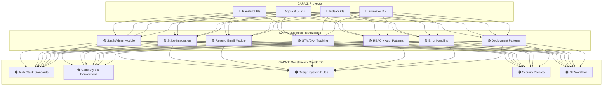
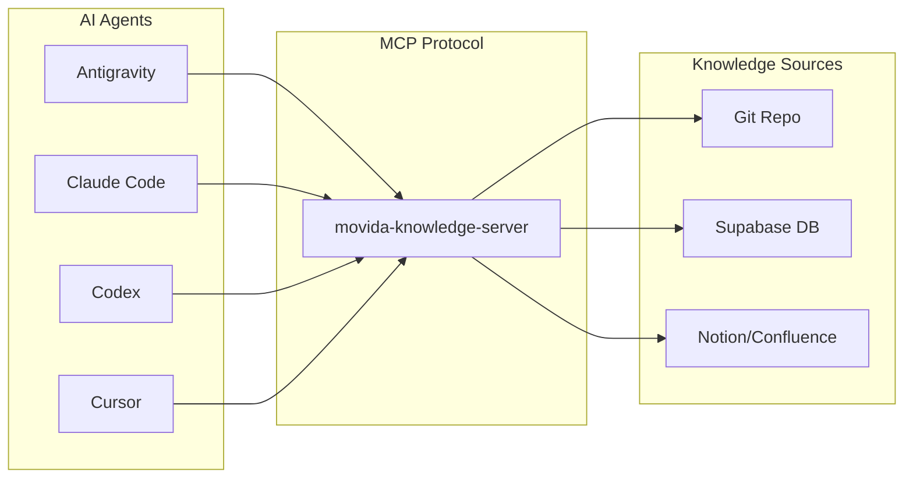
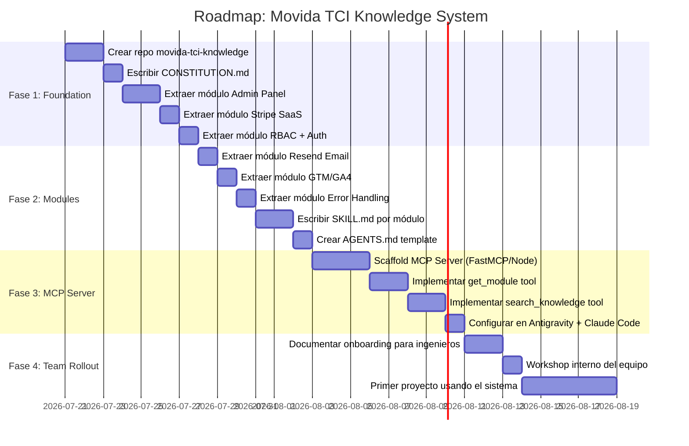

# Movida TCI — Estrategia de Conocimiento AI para Equipos de Ingeniería

> **Autor:** Antigravity AI / Jonathan Palacios
> **Fecha:** Julio 17, 2026
> **Versión:** 1.0 — Roadmap Estratégico

---

## 1. La Visión

Movida TCI desarrolla múltiples productos SaaS simultáneamente (RankPilot, Ágora Plus, PideYa, Formatex WMS, DoctorYa, ERP Movida, etc.). Cada proyecto resuelve problemas similares:

- **Autenticación y RBAC** (Supabase Auth + roles)
- **Panel de Administración** (Users, Settings, Marketing)
- **Pagos SaaS** (Stripe Checkout + Webhooks)
- **Email Transaccional** (Resend + Templates dinámicos)
- **Tracking y Analytics** (GTM, GA4)
- **Deployment** (Vercel + Prisma + Next.js patterns)
- **Error Handling** (sanitización, fallbacks, UX de errores)

**El problema:** Cada vez que un ingeniero (humano o AI) empieza un proyecto nuevo, reinventa la rueda. El conocimiento está fragmentado en conversaciones pasadas, KIs dispersos, y la memoria del desarrollador.

**La solución:** Crear un **sistema de conocimiento reutilizable** que funcione como el "cerebro institucional" de Movida TCI, accesible desde cualquier herramienta AI (Antigravity, Claude Code, Codex, Cursor).

---

## 2. Estado Actual: Lo Que Ya Tienes

### 2.1 Knowledge Items de Antigravity (25 KIs)

Tu directorio `~/.gemini/antigravity/knowledge/` ya contiene conocimiento valioso:

```
~/.gemini/antigravity/knowledge/
├── agora-plus-saas-v3/          ← RBAC, Admin Panel, Supabase Auth
├── agora-classification-engine-v2/ ← ETL patterns
├── rankpilot-architecture/      ← 15-node AI pipeline
├── vercel-best-practices/       ← Cross-project deployment knowledge ✅
├── pideya-architecture/         ← Mobile delivery platform
├── formatex-wms-architecture/   ← WMS patterns
├── wms-prisma-v7-config/        ← Prisma v7 gotchas
├── movida-erp-ui-patterns/      ← Searchable dropdowns, Kanban
└── ... (16 más)
```

**Lo que funciona bien:**
- Yo (Antigravity) los leo automáticamente al inicio de cada conversación
- Son `metadata.json` + `artifacts/*.md` — formato simple y portátil
- El KI `vercel-best-practices` ya es cross-project (no está atado a un repo)

**Lo que NO funciona:**
- Son **locales a tu máquina** — otro ingeniero del equipo no los tiene
- No hay distinción entre "conocimiento de proyecto" vs "conocimiento institucional"
- Claude Code, Codex, Cursor no pueden leerlos (son formato propietario de Antigravity)
- No hay versionado ni revisión de los KIs

---

## 3. Arquitectura Propuesta: 3 Capas de Conocimiento



| Capa | Nombre | Contenido | Quién lo usa |
|------|--------|-----------|-------------|
| **1** | Constitución | Stack obligatorio, convenciones, políticas | TODOS los proyectos |
| **2** | Módulos | Código reutilizable + documentación | Proyectos SaaS que lo necesiten |
| **3** | Proyecto | Arquitectura específica de cada app | Solo el proyecto |

---

## 4. Implementación Práctica: 3 Estrategias

### 4.1 Estrategia A — Repo de Conocimiento Compartido (Recomendada ⭐)

**Crear un repositorio Git central** que sea la "biblia" de Movida TCI.

```
movida-tci-knowledge/                    ← Repo Git privado
├── README.md                            ← Índice general
├── CONSTITUTION.md                      ← Reglas fundamentales
│
├── modules/                             ← Módulos reutilizables
│   ├── admin-panel/
│   │   ├── README.md                    ← Documentación del módulo
│   │   ├── SKILL.md                     ← Instrucciones para AI agents
│   │   ├── schema.prisma.example        ← Schema base (User, SystemConfig)
│   │   ├── server-actions/              ← Código copy-paste listo
│   │   │   ├── admin.ts
│   │   │   ├── settings.ts
│   │   │   └── smtp.ts
│   │   └── components/                  ← UI components
│   │       ├── AdminTabs.tsx
│   │       ├── AddUserModal.tsx
│   │       └── AdminDashboard.tsx
│   │
│   ├── stripe-saas/
│   │   ├── README.md
│   │   ├── SKILL.md
│   │   ├── api/
│   │   │   ├── checkout/route.ts
│   │   │   └── webhooks/stripe/route.ts
│   │   └── env.example
│   │
│   ├── resend-email/
│   │   ├── README.md
│   │   ├── SKILL.md
│   │   ├── templates/
│   │   └── server-actions/smtp.ts
│   │
│   ├── rbac-auth/
│   │   ├── README.md
│   │   ├── SKILL.md
│   │   ├── middleware.ts
│   │   └── patterns.md
│   │
│   ├── error-handling/
│   │   ├── README.md
│   │   ├── SKILL.md
│   │   ├── safe-json-parse.ts
│   │   └── error-response-factory.ts
│   │
│   └── tracking-analytics/
│       ├── README.md
│       ├── SKILL.md
│       └── gtm-ga4-setup.md
│
├── patterns/                            ← Patrones de diseño
│   ├── vercel-deployment.md
│   ├── prisma-v7-config.md
│   ├── supabase-pooler.md
│   └── premium-ui-glassmorphism.md
│
└── architecture/                        ← Decisiones de arquitectura
    ├── adr-001-supabase-auth.md
    ├── adr-002-prisma-over-drizzle.md
    └── adr-003-vanilla-css-over-tailwind.md
```

**¿Cómo lo usan los AI agents?**

Cada proyecto incluiría en su raíz un archivo `AGENTS.md` (o `CLAUDE.md` / `.cursorrules`) que referencia el repo de conocimiento:

```markdown
# AI Agent Context — [Nombre del Proyecto]

## Constitución Movida TCI
Este proyecto sigue la Constitución Movida TCI. Referencia obligatoria:
- Stack: Next.js 16 + Prisma v7 + Supabase + Vanilla CSS
- Deploy: Vercel (dev→main auto-deploy)
- Auth: Supabase Auth con RBAC (USER/ADMIN/SUPERADMIN)

## Módulos Integrados
Este proyecto usa los siguientes módulos del repo `movida-tci-knowledge`:
- ✅ admin-panel (ver modules/admin-panel/SKILL.md)
- ✅ stripe-saas (ver modules/stripe-saas/SKILL.md)
- ✅ resend-email (ver modules/resend-email/SKILL.md)
- ✅ rbac-auth (ver modules/rbac-auth/SKILL.md)

## Instrucción para AI Agents
Cuando necesites implementar alguno de estos módulos:
1. Lee el SKILL.md del módulo correspondiente
2. Adapta el código al contexto de ESTE proyecto
3. NO reinventes la rueda — usa los patrones establecidos
```

---

### 4.2 Estrategia B — Custom MCP Server (Avanzada 🔥)

**Crear un MCP Server propio** que exponga el conocimiento de Movida TCI como herramientas para cualquier AI agent.



**¿Qué haría el MCP Server?**

```typescript
// Herramientas que expone el MCP Server
const tools = [
  {
    name: "get_module",
    description: "Retrieves a reusable Movida TCI module with code + docs",
    input: { module_name: "admin-panel | stripe-saas | resend-email | ..." }
  },
  {
    name: "get_pattern", 
    description: "Retrieves a development pattern or best practice",
    input: { pattern_name: "vercel-deploy | prisma-v7 | supabase-pooler | ..." }
  },
  {
    name: "search_knowledge",
    description: "Semantic search across all Movida TCI knowledge",
    input: { query: "how to implement Stripe webhooks" }
  },
  {
    name: "get_constitution",
    description: "Returns the Movida TCI tech constitution and standards"
  },
  {
    name: "log_decision",
    description: "Logs an architecture decision for future reference",
    input: { decision: "...", rationale: "...", project: "..." }
  }
];
```

**Cómo se configura en cada herramienta:**

```json
// ~/.gemini/antigravity/mcp_config.json (Antigravity)
{
  "servers": {
    "movida-knowledge": {
      "command": "node",
      "args": ["/path/to/movida-knowledge-server/index.js"],
      "env": { "KNOWLEDGE_REPO": "/path/to/movida-tci-knowledge" }
    }
  }
}
```

```json
// .claude/mcp.json (Claude Code)
{
  "mcpServers": {
    "movida-knowledge": {
      "command": "node",
      "args": ["/path/to/movida-knowledge-server/index.js"]
    }
  }
}
```

```json
// .cursor/mcp.json (Cursor)
{
  "mcpServers": {
    "movida-knowledge": {
      "command": "node",
      "args": ["/path/to/movida-knowledge-server/index.js"]
    }
  }
}
```

**Beneficio clave:** Un solo MCP Server sirve a TODAS las herramientas. Si actualizas un módulo, todos los agents ven el cambio instantáneamente.

---

### 4.3 Estrategia C — Antigravity Knowledge Sync (Simple)

**Sincronizar los KIs de Antigravity** entre las máquinas del equipo usando Git + symlinks.

```bash
# 1. Extraer KIs cross-project a un repo
cd movida-tci-knowledge/antigravity-kis/
cp -r ~/.gemini/antigravity/knowledge/vercel-best-practices .
cp -r ~/.gemini/antigravity/knowledge/agora-plus-saas-v3 .

# 2. En la máquina de cada ingeniero, crear symlinks
ln -s /path/to/movida-tci-knowledge/antigravity-kis/vercel-best-practices \
      ~/.gemini/antigravity/knowledge/vercel-best-practices

# 3. Git pull para sincronizar
cd movida-tci-knowledge && git pull
```

**Pros:** Simple, funciona hoy mismo.
**Contras:** Solo sirve para Antigravity, no para Claude Code/Codex/Cursor.

---

## 5. Los 7 Módulos Reutilizables a Extraer

Basado en lo que hemos construido juntos en RankPilot y Ágora Plus:

### Módulo 1: Admin Panel SaaS

```
Origen: RankPilot + Ágora Plus
Archivos:
  - /dashboard/admin/page.tsx (Dashboard KPIs)
  - /dashboard/admin/users/page.tsx (3 sub-tabs: SaaS, Manual, Admins)
  - /dashboard/admin/settings/page.tsx (Stripe, Maintenance)
  - /dashboard/admin/marketing/page.tsx (GTM, GA4)
  - /dashboard/admin/smtp/page.tsx (Resend templates)
  - components/AdminTabs.tsx
  - components/AddUserModal.tsx
  - actions/admin.ts (createUser, toggleStatus, deleteUser)
  - actions/settings.ts (getSystemConfig, saveSystemConfig)
  - Prisma: User (role enum), SystemConfig, EmailTemplate
```

### Módulo 2: Stripe SaaS Pipeline

```
Origen: RankPilot + Ágora Plus
Archivos:
  - api/checkout/route.ts
  - api/webhooks/stripe/route.ts
  - Eventos: checkout.session.completed, invoice.payment_failed,
             customer.subscription.deleted
  - Auto-crea usuario en Supabase Auth + Prisma
  - Envía email de bienvenida
```

### Módulo 3: Resend Email Engine

```
Origen: Ágora Plus → RankPilot
Archivos:
  - actions/smtp.ts (saveResendConfig, testConnection, getTemplates)
  - EmailTemplate model (WELCOME, DUNNING, REMINDER)
  - HTML template injection dinámico
```

### Módulo 4: RBAC + Auth

```
Origen: Ágora Plus → RankPilot → Formatex
Archivos:
  - Supabase Auth integration
  - Prisma User model con role: USER | ADMIN | SUPERADMIN
  - Server Action protections (role checks)
  - Sidebar conditional rendering (Admin Panel link)
  - Layout server components que fetch user role
```

### Módulo 5: GTM/GA4 Tracking

```
Origen: Ágora Plus → RankPilot
Archivos:
  - actions/settings.ts (saveGTMConfig, saveGAConfig)
  - Script injection en layout.tsx
  - SystemConfig model (gtmId, gaId fields)
```

### Módulo 6: Error Handling & Resilience

```
Origen: RankPilot v5.0 (este proyecto)
Archivos:
  - safeJsonParse() (4 estrategias de fallback)
  - sanitizeText() / sanitize_unicode()
  - createErrorResponse() (códigos tipados)
  - Error UI component (badge, retry, support)
  - Partial data persistence on failure
```

### Módulo 7: Vercel + Prisma Deployment

```
Origen: Cross-project (ya existe como KI)
Archivos:
  - Pooler vs Direct connection
  - TypeScript strict typing
  - tsconfig excludes
  - Next.js 16+ proxy migration
  - prisma generate && next build
```

---

## 6. Roadmap de Implementación



---

## 7. El Archivo SKILL.md — Formato Estándar

Cada módulo debe tener un `SKILL.md` que cualquier AI agent pueda leer:

```markdown
# SKILL: Admin Panel SaaS Module

## Descripción
Módulo completo de panel de administración para aplicaciones SaaS 
de Movida TCI. Incluye dashboard de KPIs, gestión de usuarios con 
3 categorías, configuración de sistema, y email templates.

## Pre-requisitos
- Next.js 16+ (App Router)
- Prisma v7 con PostgreSQL (Supabase)
- Supabase Auth configurado
- Vanilla CSS (NO Tailwind)

## Modelos de Base de Datos Requeridos
Agregar al schema.prisma:
- User: agregar campos `role`, `accountType`, `isActive`, `stripeCustomerId`
- SystemConfig: crear modelo singleton
- EmailTemplate: crear modelo con type enum

## Archivos a Crear
1. `/dashboard/admin/page.tsx` ← Dashboard con KPIs
2. `/dashboard/admin/users/page.tsx` ← 3 sub-tabs
3. `/dashboard/admin/settings/page.tsx` ← Configuración
4. `/actions/admin.ts` ← Server Actions protegidas
5. `/actions/settings.ts` ← System config CRUD
6. `/components/AdminTabs.tsx` ← Navegación por tabs
7. `/components/AddUserModal.tsx` ← Modal glassmorphism

## Instrucciones de Integración
1. Copiar los modelos al schema.prisma existente
2. Ejecutar `npx prisma db push`
3. Copiar los archivos a las rutas indicadas
4. Agregar el link "Admin Panel" al Sidebar con condicional de rol
5. Agregar layout.tsx con server component que lee userRole
6. Configurar env vars: SUPABASE_SERVICE_ROLE_KEY

## Variables de Entorno
SUPABASE_SERVICE_ROLE_KEY=sb_secret_...

## Testing
- Crear usuario SUPERADMIN manualmente en Prisma Studio
- Verificar que USER no ve el link "Admin Panel"
- Verificar que ADMIN ve usuarios pero no settings
- Verificar que SUPERADMIN ve todo

## Errores Comunes
- "User not found": Sincronizar Supabase Auth ID con Prisma User ID
- "Unauthorized": Verificar role check en Server Action
- Build fail: Agregar `SUPABASE_SERVICE_ROLE_KEY` a Vercel env vars
```

---

## 8. Ejemplo: Cómo un Ingeniero Usa el Sistema

### Escenario: Nuevo proyecto "LegalTrack" necesita Admin Panel + Stripe

```
Ingeniero: "Necesito agregar panel de administración con Stripe a LegalTrack"

AI Agent (cualquiera):
1. Lee AGENTS.md del proyecto → ve que Movida TCI knowledge está disponible
2. Lee CONSTITUTION.md → confirma stack (Next.js + Prisma + Supabase)
3. Lee modules/admin-panel/SKILL.md → sabe exactamente qué crear
4. Lee modules/stripe-saas/SKILL.md → sabe la integración de pagos
5. Adapta el código al contexto de LegalTrack
6. Crea todos los archivos con los patrones probados
7. Lista las env vars necesarias
```

**Resultado:** En vez de 3 horas de conversación explicando cómo funciona el admin panel, el ingeniero (humano o AI) ejecuta en 20 minutos con calidad consistente.

---

## 9. Comparativa de Estrategias

| Criterio | A: Repo Git | B: MCP Server | C: KI Sync |
|----------|-------------|---------------|------------|
| **Dificultad** | 🟢 Fácil | 🟡 Media | 🟢 Fácil |
| **Cross-tool** | 🟢 Sí (via AGENTS.md) | 🟢 Sí (protocolo MCP) | 🔴 Solo Antigravity |
| **Cross-team** | 🟢 Git clone | 🟢 npm install | 🟡 Symlinks |
| **Búsqueda** | 🟡 grep/search | 🟢 Semántica | 🔴 Manual |
| **Versionado** | 🟢 Git history | 🟢 Git + API | 🟡 Git |
| **Actualización** | 🟢 git pull | 🟢 Automática | 🟡 Manual |
| **Costo** | 🟢 $0 | 🟡 Dev time | 🟢 $0 |
| **Recomendación** | ⭐ **Empezar aquí** | 🔥 Fase 2 | ❌ Temporal |

---

## 10. Próximos Pasos Inmediatos

### Sprint 1 (Esta semana)

- [ ] Crear repo privado `movida-tci-knowledge` en GitHub
- [ ] Escribir `CONSTITUTION.md` con reglas del stack
- [ ] Extraer módulo Admin Panel desde RankPilot (este repo)
- [ ] Extraer módulo RBAC desde Ágora Plus
- [ ] Crear template de `AGENTS.md` para futuros proyectos

### Sprint 2 (Semana siguiente)

- [ ] Extraer módulos Stripe, Resend, GTM/GA4
- [ ] Escribir `SKILL.md` para cada módulo
- [ ] Agregar `AGENTS.md` a RankPilot, Ágora Plus, y próximo proyecto
- [ ] Documentar onboarding para equipo

### Sprint 3 (Siguiente)

- [ ] Evaluar FastMCP para MCP Server propio
- [ ] Implementar `get_module` y `search_knowledge` tools
- [ ] Configurar en Antigravity vía `mcp_config.json`
- [ ] Probar con Claude Code y Cursor

---

## 11. Referencias Técnicas

| Recurso | URL | Propósito |
|---------|-----|-----------|
| Model Context Protocol | modelcontextprotocol.io | Especificación del protocolo MCP |
| FastMCP (Python) | github.com/jlowin/fastmcp | Framework para crear MCP servers rápidamente |
| MCP TypeScript SDK | github.com/modelcontextprotocol/typescript-sdk | SDK oficial para MCP servers en Node.js |
| Antigravity KI Format | `~/.gemini/antigravity/knowledge/*/metadata.json` | Formato de Knowledge Items |
| Claude CLAUDE.md | docs.anthropic.com | Formato de memory files para Claude Code |

---

*Documento creado como guía estratégica para Movida TCI. Julio 17, 2026.*
*Este es un documento vivo que debe actualizarse a medida que se implementen las fases.*
