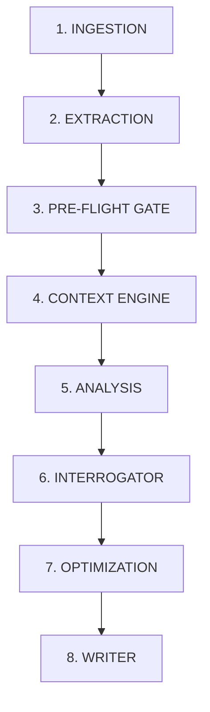

# RankPilot AI Pipeline — Technical Documentation v7.1

> **Version**: v21.1 (Option D Architecture)  
> **Model**: gpt-5.6-terra  
> **Last Updated**: 2026-08-14

---

## Pipeline Architecture Overview

---

## Node 1: INGESTION (`ingestion_node`) — Line 738
- Receives uploaded DOCX, extracts raw text from tables/paragraphs
- Preserves **original B10/B7 narrative** (v17.3)
- Creates Pipeline Manifest (hash, word count, timestamp)
- **Band validation:** None

## Node 2: EXTRACTION (`extraction_node`) — Line 836
- LLM extracts structured data: firm_name, practice_area, jurisdiction, matters[], department_heads[]
- Applies Confidentiality Guardrail (v10.1), Extraction Validator (v14.0)
- **Band validation:** Extracts user-declared ranking only

## Node 3: PRE-FLIGHT GATE (`pre_flight_gate_node`) — Line 955
- Validates extraction quality, auto-corrects jurisdiction (v18.1: DOCX > UI dropdown)
- Gates pipeline if quality too low
- **Band validation:** Indirect — jurisdiction resolution affects RAVL config

## Node 4: CONTEXT ENGINE (`context_engine_node`) — Line 1230
### THIS IS WHERE BAND/RANKING VALIDATION HAPPENS
- Loads directory config and RAG files
- **RAVL** (v16.0, line 1412): Looks up ranking_architecture.json
  - **Scenario A**: Firm bands exist (Banking Mexico = Bands 1-3)
  - **Scenario B**: Individuals only (Data Protection Mexico = No firm bands)
  - **Scenario C**: No ranking exists
  - **Scenario D**: Unknown
- **LIVE BENCHMARK ENGINE** (v17.2, line 1438): Scrapes chambers.com in real-time
  - Finds firm's actual current band
  - Overrides "Unranked" with verified band
  - Resolves regional jurisdictions
- **Band validation:** PRIMARY — knows about bands

## Node 5: ANALYSIS (`analysis_node`) — Line 1608
- The "brain" — generates Strategic Audit
- **RAVL enforcement in prompt** (v17.4, line 1787):
  - Scenario B: "ONLY individual rankings. MUST NOT reference firm bands."
- Generates: Practice Intelligence, Thesis, Identity, Hypotheses, Refutation, Comparative Analysis, Editorial Confidence, Blueprint
- Applies External Validation Elimination (v17.5)
- **Band validation:** CRITICAL — RAVL rules injected into LLM prompt

## Node 6: INTERROGATOR (`interrogator_node`) — Line 2245
- Reviews analysis quality, generates "What's Needed" recommendations
- **Band validation:** Inherits RAVL context

## Node 7: OPTIMIZATION (`optimization_node`) — Line 2264
- **v21.1 B7 OPTION D**: Immutable Source + LLM Insertions (original never rewritten)
- **v21.1 Grammar Patches**: Specific edits only, protected patterns auto-rejected
- Matter count enforcement: never lose a matter
- **Band validation:** Not directly

## Node 8: WRITER (`writer_node`) — Line 3146
- Packages results, sends callback to Next.js frontend for DOCX generation
- **Band validation:** Passthrough only

---

## RAVL Scenarios Reference

| Scenario | Meaning | Example | Firm Band Language |
|---|---|---|---|
| **A** | Firms + Individuals | Banking, Mexico | Allowed |
| **B** | Individuals only | Data Protection, Mexico | PROHIBITED |
| **C** | No ranking exists | — | PROHIBITED |
| **D** | Unknown | Banking, Venezuela | PROHIBITED |

### Scenario B Rules
1. Cannot say: "Band 5 firms", "peer firms", "entry-level firms", "departmental ranking"
2. Must say: "individuals-only category", "individual recognition candidacy"
3. Should analyze: Can evidence support future departmental recognition?
4. Should compare: How do lawyers compare to currently recognized individuals?

---

## Key Config Files
- `ai-engine/config/ranking_architecture.json` — RAVL scenarios
- `ai-engine/config/benchmark_url_map.json` — Live scraping URLs
- `ai-engine/utils/validators.py` — RAVL lookup, external validation elimination

---

## Changelog

### v21.1 (2026-08-14) — Option D Architecture
- B7: Immutable Source + LLM Insertions (no more full rewrite)
- Grammar: Patch-based (protected patterns auto-rejected)
- PRESERVE+ENRICH now DEFAULT (removed 400w threshold)

### v21.0.2 (2026-08-13) — AraqueReyna Fixes
- Grammar LLM for B7, jurisdiction resolution, RAVL in analysis node
- Matter count enforcement, PRESERVE+ENRICH for B10 > 400w

### v21.0 (2026-08-13) — Active Editorial Voice
- ChatGPT 5.6 Terra recommendations, active verbs, filler elimination

### v20.x (2026-08-12) — Quality Defense
- AraqueReyna support, jurisdiction auto-resolution, live benchmark auto-detect

### v18-19.x — Benchmark Engine
- Live scraping chambers.com, regional jurisdiction resolution

### v17.x — RAVL + Editorial Intelligence
- RAVL v1, Live Benchmark Engine, External Validation Elimination

### v16.0 — Ranking Architecture
- Initial RAVL, Scenario A/B/C/D, prohibited phrases enforcement
